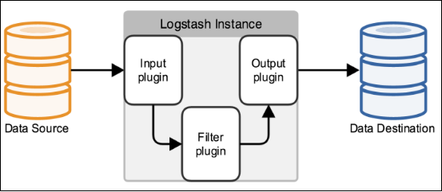
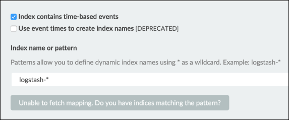
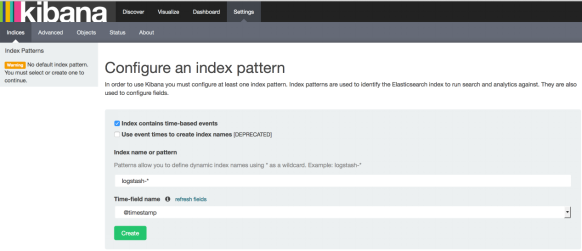
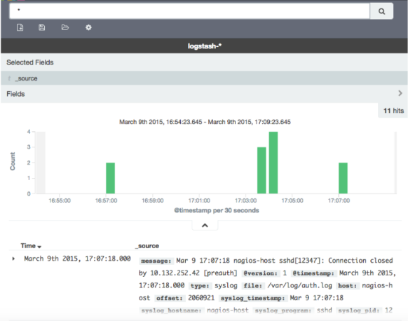

## ELK安装

### 一：安装JDK


### 二：安装logstash

```
tar zxf logstash-2.1.1.tar.gz
mv logstash-2.1.1 /ecapp/soft/
```

配置logstash的环境变量

```
# echo "export PATH=\$PATH:/ecapp/soft/logstash-2.1.1/bin" > /etc/profile.d/logstash.sh
# ./etc/profile
```


### 三：安装 Elasticsearch

**解压**

```
$ tar xzvf elasticsearch-2.1.0.tar.gz
```

文件目录结构如下：

```
$ pwd
/home/elk/elasticsearch-2.1.0
$ ls
bin
config
lib
LICENSE.txt
NOTICE.txt
README.textile
```

**修改配置文件**

```
$ cd config
$ vi elasticsearch.yml
```

找到 ```# network.host``` 一行，修改成以下：

```
network.host: 10.211.55.30
```
**启动 elasticsearch**

```
$ cd ../bin
$ ./elasticsearch
```

验证 elasticsearch

```
$ curl '10.211.55.30:9200/'
{
 "name" : "Surge",
 "cluster_name" : "elasticsearch",
 "version" : {
 "number" : "2.1.0",
 "build_hash" : "72cd1f1a3eee09505e036106146dc1949dc5dc87",
 "build_timestamp" : "2015-11-18T22:40:03Z",
 "build_snapshot" : false,
 "lucene_version" : "5.3.1"
 },
 "tagline" : "You Know, for Search"
}
```

### 四：安装 Kibana

**解压**

```
$ tar xzvf kibana-4.3.0-linux-x64.tar.gz
```

```
$ pwd
/home/elk/kibana-4.3.0-linux-x64
$ ls
drwxr-xr-x.  2 luolong luolong 4096 Aug 13 17:13 bin
drwxr-xr-x.  2 luolong luolong 4096 Aug 13 17:13 config
drwxr-xr-x.  2 luolong luolong 4096 Nov 24  2015 installedPlugins
-rw-r--r--.  1 luolong luolong  563 Nov 24  2015 LICENSE.txt
drwxr-xr-x.  6 luolong luolong 4096 Aug 13 17:12 node
drwxr-xr-x. 79 luolong luolong 4096 Aug 13 17:12 node_modules
drwxr-xr-x.  3 luolong luolong 4096 Aug 13 17:12 optimize
-rw-r--r--.  1 luolong luolong  699 Nov 24  2015 package.json
-rw-r--r--.  1 luolong luolong 2510 Nov 24  2015 README.txt
drwxr-xr-x.  8 luolong luolong 4096 Aug 13 17:12 src
drwxr-xr-x.  2 luolong luolong 4096 Nov 24  2015 webpackShims
```

**修改配置文件**

```
$ cd config
$ vi kibana.yml
```

找到 ```# server.host```，修改成以下：

```
server.host:“10.211.55.30”
```

**启动 Kibana**

```
$ cd ../bin
$ ./kibana
[…]
 log [07:50:29.926] [info][listening] Server running at http://10.211.55.30:5601
[…]
```

**验证 Kibana**

由于我们是配置在 localhost，所以是无法直接访问 Web 页面的。
可以使用 netstat 来检查缺省端口 5601，或者使用 curl：

```
$ curl 10.211.55.30:5601
<script>var hashRoute = '/app/kibana';
var defaultRoute = '/app/kibana';

var hash = window.location.hash;
if (hash.length) {
 window.location = hashRoute + hash;
} else {
 window.location = defaultRoute;
}</script>
```

### 五：安装 Nginx

**配置 Nginx 官方 yum 源**

```
$ sudo vi /etc/yum.repos.d/nginx.repo
[nginx]
name=nginx repo
baseurl=http://nginx.org/packages/centos/7/$basearch/
gpgcheck=0
enabled=1
```

**安装软件**

```
$ sudo yum install nginx httpd-tools
```

**修改 Nginx 配置文件**

```
$ sudo vi /etc/nginx/nginx.conf
```

检查是否 http 块（http{...}）含有下面这一行：

```
include /etc/nginx/conf.d/*conf
```

**为 Kibana 创建一个配置文件**

```
$ sudo vi /etc/nginx/conf.d/kibana.conf
```

加入以下这一段内容：

```
server {
 listen 80;

 server_name example.com;

 location / {
 proxy_pass http://localhost:5601;
 proxy_http_version 1.1;
 proxy_set_header Upgrade $http_upgrade;
 proxy_set_header Connection 'upgrade';
 proxy_set_header Host $host;
 proxy_cache_bypass $http_upgrade;
 }
｝
```

注意：建议使用 IP。

**启动 Nginx 服务**

```
$ sudo systemctl enable nginx
$ sudo systemctl start nginx
```

**验证访问**

```http://FQDN``` 或者 ```http://IP```

### 六：安装 Logstash

**解压**

```
$ tar xzvf logstash-2.1.1.tar.gz
```

文件目录结构如下：

```
pwd
/home/elk/logstash-2.1.1

$ ls
drwxrwxrwx. 2 root root  4096 Aug 13 16:53 bin
-rwxrwxrwx. 1 root root 97345 Dec  8  2015 CHANGELOG.md
-rwxrwxrwx. 1 root root  2249 Dec  8  2015 CONTRIBUTORS
-rwxrwxrwx. 1 root root  3771 Dec  8  2015 Gemfile
-rwxrwxrwx. 1 root root 21837 Dec  8  2015 Gemfile.jruby-1.9.lock
drwxrwxrwx. 4 root root  4096 Aug 13 16:53 lib
-rwxrwxrwx. 1 root root   589 Dec  8  2015 LICENSE
-rwxrwxrwx. 1 root root   149 Dec  8  2015 NOTICE.TXT
drwxrwxrwx. 4 root root  4096 Aug 13 16:54 vendor
```

**验证 Logstash**

```
$ cd bin
$ ./logstash -e 'input { stdin { } } output { stdout {} }'
Settings: Default filter workers: 1
Logstash startup completed
```

显示如下：

```
hello elk stack
2015-12-14T01:17:24.104Z 0.0.0.0 hello elk stack
```

### 七：配置 Logstash

我们需要配置 Logstash 以指明从哪里读取数据，向哪里输出数据。这个过程我们称之为定义 Logstash 管道（Logstash Pipeline）。

通常一个管道需要包括必须的输入（input），输出（output），和一个可选项目 Filter。见图 7。

图 7.Logstash 管道结构示意



标准的管道配置文件格式如下：

```
# The # character at the beginning of a line indicates a comment. Use
# comments to describe your configuration.
input {
}
# The filter part of this file is commented out to indicate that it is
# optional.
#filter {
#}
output {
}
```

每一个输入/输出块里面都可以包含多个源。Filter 是定义如何按照用户指定的格式写数据。

由于我们这次是使用 logstash-forwarder 从客户机向服务器来传输数据，作为输入数据源。所以，我们首先需要配置 SSL 证书（Certification）。用来在客户机和服务器之间验证身份。

**配置 SSL**

```
$ sudo mkdir -p /etc/pki/tls/certs etc/pki/tls/private
$ sudo vi /etc/pki/tls/openssl.cnf
```

找到 [v3_ca] 段，添加下面一行，保存退出。

```
subjectAltName = IP: logstash_server_ip

$ cd /etc/pki/tls
$ sudo openssl req -config /etc/pki/tls/openssl.cnf -x509 -days 3650 -batch -nodes -newkey
         rsa:2048 -keyout private/logstash-forwarder.key -out certs/logstash-forwarder.crt

```

执行下面命令：

```
$ cd /etc/pki/tls
$ sudo openssl req -config /etc/ssl/openssl.cnf -x509 -days 3650 -batch -nodes -newkey rsa:2048 -keyout
         private/logstash-forwarder.key -out certs/logstash-forwarder.crt
```

这里产生的 logstash-forwarder.crt 文件会在下一节安装配置 Logstash-forwarder 的时候使用到。

**配置 Logstash 管道文件**

```
$ cd /home/elk/logstash-2.1.1
$ mkdir conf
$ vi simple.conf
```

添加以下内容：

```
input {
 lumberjack {
 port => 5043
 type => "logs"
 ssl_certificate => "/etc/pki/tls/certs/logstash-forwarder.crt"
 ssl_key => "/etc/pki/tls/private/logstash-forwarder.key"
 }
}
filter {
 grok {
 match => { "message" => "%{COMBINEDAPACHELOG}" }
 }
 date {
 match => [ "timestamp" , "dd/MMM/yyyy:HH:mm:ss Z" ]
 }
}
output {
 elasticsearch { hosts => ["10.211.55.30:9200"] }
 stdout { codec => rubydebug }
}
```

**启动 Logstsh**

```
$ cd /home/elk/logstash-2.1.1/bin
$ ./logstash -f ../conf/simple.conf
```

### 八：安装 Logstash-forwarder

**注意：**Logstash-forwarder 也是一个开源项目，最早是由 lumberjack 改名而来。在作者写这篇文章的时候，被吸收合并到了 Elastic.co 公司的另外一个产品 Beat 中的 FileBeat。如果是用 FileBeat，配置稍微有些不一样，具体需要去参考官网。

**安装 Logstash-forwarder 软件**

注意：Logstash-forwarder 是安装在另外一台机器上。用来模拟客户机传输数据到 Logstash 服务器。

**配置 Logstash-forwarder 安装源**

执行以下命令：

```
$ sudo rpm --import http://packages.elastic.co/GPG-KEY-elasticsearch

$ sudo vi /etc/yum.repos.d/logstash-forwarder.repo
```

加入以下内容：

```
[logstash-forwarder]
name=logstash-forwarder repository
baseurl=http://packages.elastic.co/logstashforwarder/centos
gpgcheck=1
gpgkey=http://packages.elasticsearch.org/GPG-KEY-elasticsearch
enabled=1
```

**配置 SSL**

```
$ sudo mkdir -p /etc/pki/tls/certs
```

把在步骤六中在 Logstash 服务器上产生的 ssl 证书文件拷贝到刚刚创建出来的目录下：

```
$ sudo scp user@logstash_server:/etc/pki/tls/certs/logstash_forwarder.crt /etc/pki/tls/certs/
```
**配置 Logstash-forwarder**

```
$ sudo vi /etc/logstash-forwarder.conf
```

在 network 段（"network": {），修改如下：

```
"servers": [ "10.211.55.30:5043" ],
"ssl ca": "/etc/pki/tls/certs/logstash-forwarder.crt",
"timeout": 15
```

在 files 段（"files": [），修改如下：

```
{
"paths": [
 "/var/log/syslog",
 "/var/log/auth.log"
 ],
 "fields": { "type": "syslog" }
}
```

**启动 Logstash-forwarder**

```
$ sudo service logstash-forwarder start
```

**验证 Logstash-forwarder**

```
$ sudo service logstash-forwarder status
logstash-forwarder is running
```

如果有错误，则需要去/var/log/logstash-forwarder 目录下面检查。

### 九：最后验证

在前面安装 Kibana 的时候，曾经有过验证。不过，当时没有数据，打开 Web 页面的时候，将如下所示：

图 8. 无数据初始页面



现在，由于 logstash-forwarder 已经开始传输数据了，再次打开 Web 页面，将如下所示：

图 9. 配置索引页面



点击创建按钮（Create），在选择 Discover，可以看到如下画面：

图 10. 数据展示页面



至此，所有部件的工作都可以正常使用了。关于如何具体使用 Kibana 就不在本文中加以描述了，有兴趣的同学可以参考官网。
