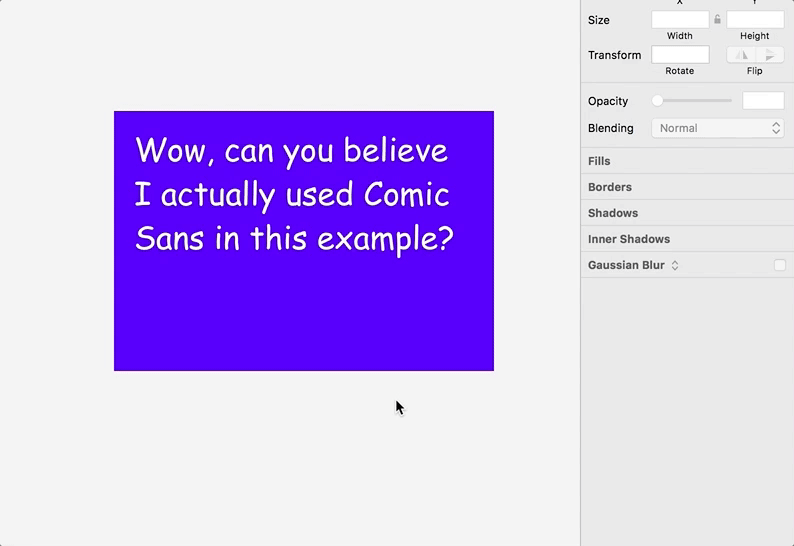
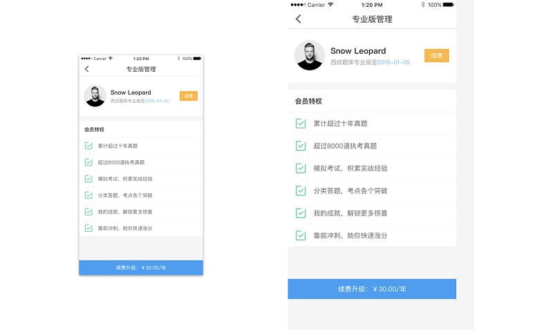

每个设计师看文章都有自己的喜好，有些人喜欢看一些纯设计技法或者设计教程，有些人喜欢看一些偏理论的知识点，比如工作经验、设计流程、设计分析等等。其实作为一名UI设计师应该看文章不要挑剔，每一方面都要看一下，这样才能更好的提升自己的设计水平和管理能力。

今天主要来跟大家聊聊我自己的工作习惯和方法，相信作新人看了一定会收获很多~

## 1.  一般怎么规划好工作上的需求？

我使用teambition软件来管理我的日常需求，teambition是一款团队协作软件，由于公司使用的是tower，所以目前teambiton我是用来管理个人需求。我用过tower，可能觉得界面不够美观，有些地方体验不是特别好，不过用来团队协作应该也是不错的。由于朋友的推荐，我就尝试用teambiton来管理个人的日常需求，发现已经能够满足日常的工作需要了。下面我放上几张截图来说明我如何使用teambition。因为teambition功能点非常多，这里只是做个示例，希望有兴趣的自己体验一下。

产品设计流程图（PM）

App设计流程图

适合全新App设计，整理出所有大致需要做的东西，然后按照从左到右的顺序分别完成。

设计走查 – 界面视觉

这里是设计走查的界面视觉的详情页，我这里只是大概的写了一下，卡片内可以设置时间、上传附件、添加子任务等等。

每日工作流程图

这是我日常的工作流程，这里只是举个例子，所以每项基本就列了一项，每日工作回顾是每天要回顾一些东西，比如查看邮箱、查看Tower上任务等。需求列表主要是放置一些需要完成的任务事项。进行中的意思是今天正在做的事项。本周完成事项是把这周完成的事项都拖到这里，方便周末的时候写周报。Bug列表主要是平常体验App发现的问题，然后记录在这里方便以后解决。

感兴趣的可以自己去研究一下teambition软件，类似的软件有很多，比如tower、trello等等，大家找到适合自己的就行，它是一个团队协作软件，比较适合团队之间的合作，而且teambition也提供了很多流程模板，具体的teambition使用方法可以去看官网（支持各大平台），如果有问题可以留言~这里就不再讲述了。

## 2.  UI设计会用到哪些工具，推荐一个你喜欢的功能点？

我一般用sketch完成UI界面设计，zeplin完成标注，我所知道的大部分UI设计师都是用sketch来做界面设计，Sketch Measure来标注；也有设计师用PS来做设计稿（可能公司没配Mac），如果你之前还是用PS做移动UI界面，可以尝试一下Sketch，不过sketch现在采用了年费制度，你可以先下载下来体验一下。下面我来简单介绍一下Sketch44的一个新功能，希望你喜欢~

**Sketch 44的Resizing功能**

前面的功能介绍来自Medium的Jon Moore的，主要是为了方便大家学习，后面我会具体操作示范。

20px的正方形白色盒子距离紫色上方和右方固定；

虽然间距固定于边角了，但是你会发现由于缩放的时候白色矩形大小在缩小，因为没设置Fix Width和Fix Height。

白色矩形宽度不变，距离上方、右侧、下方间距不变（固定上方、下方、右边，Fix Width）。

白色居中居中显示（设置Fix Width和Fix Height）。

文字段落距离两侧和上方间距不变（固定上方、右边、左边）。

文字距离段落两侧不变（固定右边和左边）。

演示设计稿750 x 1334如何变到1242 x 2208尺寸。

首先把750尺寸设计稿缩放到150%（因为@3x和@2x是1.5倍关系），得到下面的图:左侧：750×1334，右侧1125×2001。

直接修改画板大小，1125×2001大小改成1242×2208尺寸，得到下面的图:左侧：750×1334，右侧1242×2208。

最终适配图：左侧750×1334，右侧1242×2208，这个页面还不算特别复杂，只是通过这个简单的案例希望大家可以举一反三，其实在实际工作中一般也不需要做2套不同尺寸的图~

## 3.  如何整理设计文档，怎么分类比较好？

下面是我自己工作的分类图，我是参考了其他人的文件分类，然后按照自己的工作习惯整理的，所以大家也可以参考一下，做出符合自己的文件夹分类。

## 4.  怎么样才能在Dribbble、Pinterest找到相应的UI界面？

其实一般国内花瓣网就足够了，如果你翻墙去国外网站或者google上找相应的UI界面，那就必须了解UI界面的相关词汇了，我这里给大家总结一些，希望大家下去自己平常多多积累，这样就不用担心搜不到相关页面了。

最后希望这篇文章能够帮到一些新手UI设计师，目的是为了提升自己的工作流程，把工作做的更好，谢谢~如果有问题可以留言告诉我，我会第一时间回复。
