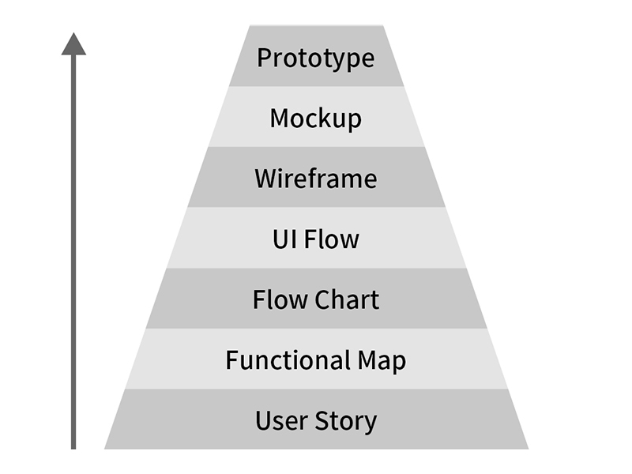

[TOC]
收到一封 Mail，其中提到几个关于设计流程和 Prototype 的问题。UI设计流程：Wireframe->低保真Prototyple->Mockup->高保真Prototyple，这样的流程是对的吗？今天来聊聊一个完整的 UI 设计流程应该是怎样的，收干货！

根据上过课的学员响应、以及自身经验，目前业界的情况大多是 UI 设计师收到「开工啦」的通知，然后就从 Wireframe 开始下手。用户怎么操作、有哪些功能、用户和客户的需求是什么往往靠 PM 简单口述。

Wireframe 为什么会长这样？在 Wireframe 之前还有哪些事要做？

全部都靠通灵。

所以执行项目期间都在改来改去，撑到最后一天总是可以结案就解脱了嘛，再开始下个改来改去的轮回。

## 开发流程

基本上我自己在开发产品的流程大致上不会脱离这张图太远。

1.User Story

2.Functional Map

3.Flow Chart

4.UI Flow

5.Wireframe

6.Mockup

7.Prototype

使用者要什么？ > 从需求中整理出功能 > 用户怎么操作这些功能？ > 操作的过程需要哪些页面？ > 页面要放什么内容/组件？怎么被操作？ > 使用者看到的页面长什么样子？

各家有各家的作法，没有标准或正确一定要这样做的流程，但我在做自己的玩具时都会这样干。

有 UX 团队的大公司会把上述流程拆的更细，还会做使用者研究之类；一人 UI/UX 通包的小型团队…这 7 项是最低一定要产出的文件，依个人想偷懒的惨痛经验，再删除精简化就会在执行项目的过程中漏东漏西，之后补洞反而花更多时间和心力。

## 1. User Story

功能怎么来的？从「使用者要什么」或「客户预期使用者想要什么」开始。
依用户的身份不同，想要的功能也会不同，完成的任务不一样嘛。

比如「Blog」：

我是读者，我要看到这位作者写的所有文章。
我是作者，我要撰写并发布文章。
我是平台提供商，我要看到所有会员身份和缴费状态。

这三种身份对「Blog」这项产品的需求和预期完全不同。

## 2. Functional Map

写了 User Story，才会知道有哪些大小功能要做。针对不同使用者的需求，从故事中挑出功能。使用者的身份不同往往影响他们能使用的功能，整理归纳出共通和差异处。

## 3. Flow Chart

当开发者知道使用者想要什么、也有了功能，才有办法思考「用户怎么操作功能完成他的任务或达到目的」。

UI 设计师常说：「配合用户的习惯与行为来设计操作流程」。就是在这一阶段规划。如果跳过 Flow Chart，只要产品功能复杂起来，你家的 RD 就会抱着头哀嚎了。

## 4. UI Flow

知道用户会怎么操作一项功能时，才有办法规划操作动线。UI Flow 指的是页面与页面之间的操作流程，用户想完成任务会经过多少页面之类。

有另一位读者传讯问道，为什么我之前的文章说不要用图片版的 UI Flow、要用文字版的呢？

首先，这是鸡生蛋蛋生鸡的问题。如果这个项目从零开始，把 Flow Chart 规划完后接着做 UI Flow，这时候哪来的图片版可以串 Flow？连 Wireframe 都还没开始画哩！

第二，当你的产品页面一多的时候…也不用太多，20页，用图片串出一个 UI Flow ，这个 Flow 图表尺寸有多大张？谁有那个心力在一张大图上用手掌工具来回移动看页面走向？

第三，很多人做图片版的 UI Flow 时，线条连接的是「页面」和「页面」，这时候你也只知道「喔～这一页的下一页会到这里」，但你完全不会知道为什么会到这一页。要点哪里、或是发生什么事所以跑到这里来？猜猜看啊～

要靠猜猜看才会看懂的文件看它（写它）干嘛？不要浪费时间啊。

文字版的 UI Flow 我拿来当「目录」用，对照 Wireframe 的编号，找图看细节的时候快。
图片版的 UI Flow 我会用在「优化」旧产品的操作时使用，连接线会从「组件到页面」，而不是「页面到页面」，并在图片和线条旁边写上文字说明，才会知道哪个步骤可以省略或修改得更易于使用。

## 5. Wireframe

有画 Wireframe 不代表工程师就看得懂这要干嘛，光看脸皱成一团的表情你也不知道他是踢到脚指还是吃到酸梅。文字说明才是 Wireframe 的重点，包含触发、回馈、状态变化等等。

一开网页就自动出现广告、还是开启网页后等个3秒才出现广告？
广告出现10秒自动消失，还是要按(X)按钮？
网页停止30秒没有操作要不要出现广告？

工程师只会照你写的去做、不会照你想的去做。工程师不是神也不是蛔虫，他们是一般人，没有他心通这种神力，沟通上肯定会有认知落差，所以话要讲清楚，设计师的常识不等于工程师的知识。

Flow Chart、UI Flow、Wireframe 这三份文件写到一半发现什么东西漏掉回头补上是正常现象，不可能一次到位。

## 6. Mockup

视觉稿…照 Grid 和 Guideline 做吧，之后还有切图和标示文件要弄。

好处是切图和标示文件都有外挂工具可以代劳，甚至设计师只要顾好原始档、切图和标示文件都用 Avocode 或 Zeplin 解决。

坏处是，如果不太知道技术限制，做出来的东西工程师不能用就算了，他们还白挨设计师的骂。

「为什么你做出来的东西和我画的差了几px？」
「拜托！RWD 不可能完全和你画的一模一样好不好？」
「是你能力不够还是偷懒？我的图画得出来为什么你做不出来？」
「干…」

## 7. Prototype

那位读者问另外问了关于 Prototype 的问题：

高保真Prototyple是在切图给RD之后制作，那做出来的用意是在RD程序还没完成前再次确定操作上有无任何问题吗?
那高保真Prototyple就是跟成品长的一样还可以操作啰??

做 Prototype 的目的通常是测试和验证，不管是给使用者操作看看、观察使用者操作状况做使用者测试；还是工程师套完程序上线前先测看看有没有虫或哪边爆炸了。所以它一定要可以被操作，不能被实际操作是要怎么测试？脑内补完？

Prototype 要可以被操作！

Prototype 要可以被操作！

Prototype 要可以被操作！

不能被操作的都不是 Prototype。

Wireframe 可以做 Prototype，低保真原型。
Mockup 可以做 Prototype，高保真原型。
切图叫工程师写程序套版做一个，高保真原型。

我自己大多做完 Mockup 后才会出 Prototype 测试。
因为，Wireframe 做的低保真原型一般使用者看不懂也没感觉，没办法做使用者测试 =_=

Wireframe 做的 Prototype 顶多内部测试吧，但内部测试常常不太准，工程师和设计师的思维和一般人不一样，测一测重点常常歪掉…

补充说明

另一位读者看了本文后若有所感，传讯跟我讨论了下。

今天也和老板谈了是否要有 Functional Map 和 UI Flow 等等这些流程，让我们在前面讨论的时候就可以厘清，而不是在视觉稿才修改增减，他也直言我们没有那么多时间无法照这样流程，真的很无力…

没有那么多时间无法照这样流程？当然啊，因为要把时间留在后面改来改去嘛～～～～～

时间总是要花的，看是花在前期规划还是后期补洞而已。说没时间无法照流程的是根本没流程可以照吧。

想逼走员工、降低团队士气，尽量乱改没关系，反正大家都知道乱改的那个人连自己要什么都不知道只好胡乱张嘴下指令。

「有哪些看上去很高大上，实际很简单的PS技巧？」
