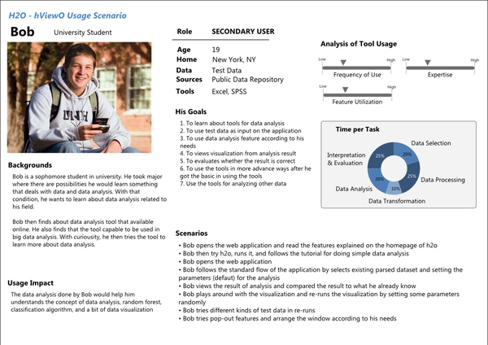

今天这篇教程是基于《软件观念革命：交互设计精髓》（About Face）写的，这也是在国际上被广为认可的流程。这个答案里我尽量不参杂个人观点，先放一个大纲。

国内知名团队UED流程见：

一、定性研究（Qualitative Research）：针对可能使用你的产品的人，可以是问卷、访谈……

二、确定人物角色（Persona）：即产品的典型用户，可以有一种或几种。例如可以有一个人物角色叫CEO。

三、写问题脚本（Problem Scenario）：罗列人物角色在使用产品时可能遇到的问题，可以整理成一个故事便于别人理解

四、写动作脚本（Action Scenario）：像写故事一样，写人物角色在使用你设计好的产品时，发生的细节。注意，这个时候你的交互方案的概念模型已经基本成型了，这个概念模型是通过解决问题脚本里的问题而得出的。

五、画线框图（Framework）：这个线框图是通过把动作脚本里的概念模型转化成视觉模型得到的。

六、制作原型（Prototype）：做出来好像可以用的东西，有很多原型工具可以利用。

七、专家评测（Expert Evaluation）：至少两名设计师或对交互设计比较了解的人通过反复测试原型。找到问题后修改线框图并更新原型。

八、用户评测（User Evaluation）：让用户使用原型，可以给他们一些任务去完成。根据用户在使用过程中的问题和建议进行进一步修改。

如果你想要知道具体怎么做，请继续看。

## 一、定性研究（Qualitative Research）：

无论你用何种形式做调查，你的目的是了解用户的五个方面：

1、行为（Activities）：例如用户多久用一次、一次用多久？

2、态度（Attitudes）：例如用户怎样看待这个产品？

3、资质（Aptitudes）：例如用户的学历怎样？

4、动力（Motivation）：例如用户为什么用？

5、技能（Skills）：例如用户对使用相关产品是否熟悉？

## 二、确定人物角色（Persona）：

如果你的定性研究有所成功，这时你应该对你的用户有所了解了。根据上文中的五个方面，你需要挑拣出最典型的一个或几个形象。例如知乎的人物角色可能有：比较普通的求知者、特定领域的专家、到处灌水的……

你不但要确定这些人物角色（Persona）的主要特点，还要确定他们的需求和目的。为了增加真实性，可以给人物角色（Persona）取名字，选一张照片，细化他们的背景资料。

以下是一个范例：（下图来自 User Evaluation Report · 480Oswego2013/CSC-HCI-480-2013-repo Wiki · GitHub）1

##三、写问题脚本（Problem Scenario）：

基于你对人物角色（Persona）的理解，你应该已经可以设想出他们在使用产品中可能遇到的问题了。你可以为每一个人物角色（Persona）列一个问题单，也可以把它们整理到一个简短的故事里。

## 四、写动作脚本（Action Scenario）：

首先你要为已列出的问题想好可能的解决方案，然后写一个简短的故事把这些解决方案囊括进去。写成故事的好处是代入感较强，对别人来说容易理解。国内比较推崇故事版，但是把所有情景画出来的效率是非常低的。

## 五、画线框图（Framework）：

这个时候你对你的交互方案已经有了一个比较抽象的想法了，现在只要把它具象化就好了。线框图大家都比较了解，这里就不多说了。

## 六、制作原型（Prototype）：

就算没有程序员帮忙，可以使用的原型工具还是很多的。例如Axure RP和Pencil Project都比较有名，国内也有不少。不过我只用过InVision，感觉还可以。不论用什么手法，哪怕是PPT或者PDF，只要做出一个可以交互的东西就行了。

一个原型是不可能实现所有功能的，所以你要确定几个可以走通的任务。例如能够成功在知乎里发布一个问题等。

七、专家评测（Expert Evaluation）：

原型完成后召集至少两三个设计师或者对交互比较了解的人，使用并评测原型。你可以将原型所关注的几个任务列出来，以免专家不知道原型哪部分可交互哪部分不可交互。

比较常用的评测方法是启发式评估法（Heuristic Evaluation），而这种方法比较常见的标准是尼尔森交互设计法则（Nielsen Heuristic）。以下是十条尼尔森交互设计法则（Nielsen Heuristic）：

1、系统状态是否可见（Visibility of system status）

2、系统是否符合现实世界的习惯（Match between system and the real world）

3、用户是否能自由地控制系统（User control and freedom）

4、统一与标准（Consistency and standards）

5、错误防范（Error prevention）

6、减轻低用户的记忆负担（Recognition rather than recall）

7、灵活性和效率（Flexibility and efficiency of use）

8、美观简洁（Aesthetic and minimalist design）

9、帮助用户认知、了解错误，并从错误中恢复（Help users recognize, diagnose, and recover from errors）

10、帮助文档（Help and documentation）

如何做启发式评估法（Heuristic Evaluation）？很简单，专家们各自将自己发现问题列出来，并将之与对应的法则相关联，或者根据法则来查找问题，然后专家们分别给自己的问题打分。专家们完成自己的问题列表后，一起讨论，将问题整合起来。

常用的打分方法如下：

4分 – 问题太过严重，一旦发生用户的进程将会终止并且无法恢复

3分 – 问题较为严重，很难能恢复

2分 – 问题一般严重，但是用户能够自行恢复，或者问题只会出现一次

1分 – 问题较小，偶尔发生，并且不会对用户的进程产生太大影响

0分：不算问题

记住：评测完后别忘记修改你的线框图和原型！

## 八、用户评测（User Evaluation）：

原型通过专家评测后，你可以找一些典型用户使用原型。你可以把任务列给他们，让他们自己尝试完成任务。中间遇到的问题可以记录下来，设计师通过观察来进行评分。

比较常用的用户评测方法是Think Aloud（对不起没有找到合适的翻译）。做法也很简单，你让用户使用原型完成指定的几个任务，让他们在使用过程中将他们的每一步和心中的想法说出来。如果他们忘记说或者不知道该怎么说，你可以适当提问。与此同时，你要将屏幕和声音录下来，可以用录屏软件或摄像头。完成后，你回放这些视频，把观察到的问题和用户报告的问题全部记录下来，与交互法则关联并且打分。
值得注意的是，很多人更习惯给出建议而不是提出问题，例如“这个按钮应该更大一点，这样才看的到”。这时，你该记录下来的是“按钮不够引人注意”。

有趣的是，用户评测的结果可能和专家评测的结果相差很远，这里就不多说了。