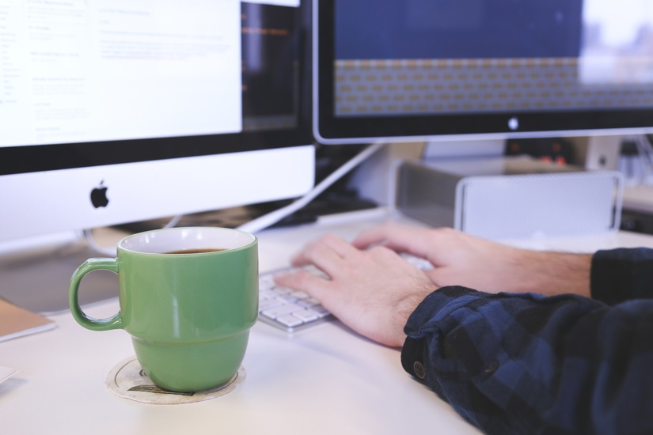

这个设计流程，更适合“对设计有要求的创业公司”，因为，它既包含大公司的规范化、核心设计过程，同时，又能适应小团队的快速作战。这个流程，虽然有9步，但其实不复杂，在我们团队，整个跨度，只有4周。学习时间到咯

第一版教程见：《超多干货！国内知名UED团队的设计流程是怎样的？》

先说我们产品开发过程中的几个角色：

PM；

交互视觉设计师（没看错，就是一个职位）；

开发；

从拿到PM的PRD开始，说说我们团队的设计流程吧：

## 1. 产品找茬

* 前提：读懂PRD。确保在需求理解上，与PM保持一致；

* 查找遗漏。人无完人，再成熟的PM，也难免有疏漏。找出遗漏，与PM反馈、沟通；（这个过程非常重要，若在设计后期（甚至开发后期）才发现疏漏，返工成本太大。）

* 提出产品新想法。读PRD时，总会有一些产品的好想法冒出来，及时与PM和团队沟通。（这个阶段，仍是产品早期，欢迎新想法）；

* 开始构思交互；

## 2. 草图快速沟通

通过草图，快速将“产品关键流程”、“关键交互及界面布局”呈现纸面，以此与PM、技术沟通至达成共识；

目的：

再次扫遗漏；

收拢想法；（这个阶段，产品设计基本定型）

达成共识；（确保让产品、设计、技术对要做的事情有一致的理解）

（PM需更新PRD、技术开始做开发准备）

## 3. Wireframe表现产品流程、界面

包含：

产品流程图；

全部的页面原型；

Wireframe让团队对产品的理解无异议，对最终的产品有直观的了解。这个阶段，产品需求冻结。开发人员可以依据原型对UI关联较小的部分进行技术开发；

## 4. 视觉设计

有前面两个“扫清障碍”的过程，这个阶段，视觉设计是非常舒服的事情…
在有相对完整的设计规范、控件规范的前提下，视觉包括：

* 风格探索；

* 关键页面的视觉设计；

* 关键的交互动画表现（如果无法口头向技术表达动画效果时，给出一个“活的”效果，是非常直观的）；

## 5. 视觉素材输出、设计文件标注

* 素材用Dropbox或酷盘存储、管理；

* Markman是不错的标注工具；

## 6. 整理、提交设计方面待数据验证的跟踪点；

主要包括：

* 待验证的产品功能点；

* 设计过程中争议比较大的部分（产品、交互、视觉）；

* 设计师没有完全把握、需要数据验证想法的部分；（比如：“点击式的菜单”与“下拉手势式的菜单”，哪个更被用户接受？）

**目的：**

* 为下个版本的设计沟通、设计过程提供数据支持；

* 通过数据，让设计师的主观判断有依据；为设计师自我观念、想法迭代提供依据（没有眼睁睁的事实，除了难改变别人的想法，也很难改变自我的想法）。

## 7. 设计文件整理、新的设计控件入库

累活。主要包括：

* 整理设计文件，方便团队其他人查阅、使用；

* 将设计过程中产生的新的控件，纳入控件库；更新控件设计规范；

## 8. 开发后期，细节跟进

与开发跟进细节，是设计过程的一部分。

在我们团队，完全依靠规范作业、设计文件标注（不和开发人员说一句话 : P），能够确保80%的交互、视觉细节能够被还原。剩下的20%，就要设计师与开发人员肩并肩坐在一起打磨了。开发过程中，一定要预留这个时间。

主要包括：

* 边距；

* 字体；

* 界面动画的数值微调；

## 9. 项目设计总结

包括：

* 设计过程中遇到的问题，以及解决方法；

* 犯的错误是？你是如何纠正的？以后如何避免？

* 分享整个设计过程中，你最有成就感的部分；

这个部分，对于初级设计师非常有帮助，能够快速成长；同时，能够检测设计过程遇到的问题，提高设计、产品开发效率。

以上是个人实战总结。

这个设计流程，更适合“对设计有要求的创业公司”，因为，它既包含大公司的规范化、核心设计过程，同时，又能适应小团队的快速作战。这个流程，虽然有9步，但其实不复杂，在我们团队，整个跨度，只有4周。

或许你有留意，我写在最前面的角色介绍里，有“交互视觉设计师”。

在我从业的过程中，着实没有发现“交互设计师”的这个职位的生存意义，无论向上向下，高素质的PM和视觉设计师都可以兼任。所以，在我们团队，我对设计师的要求是：

* 对产品的理解，不能弱于产品经理；

* 交互设计，是思维；

* 视觉表现，是手段；