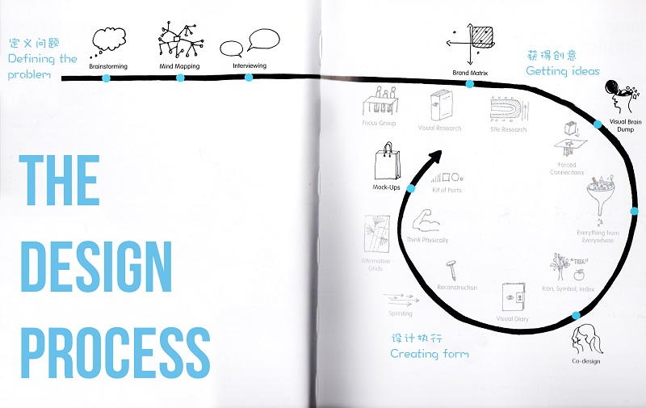
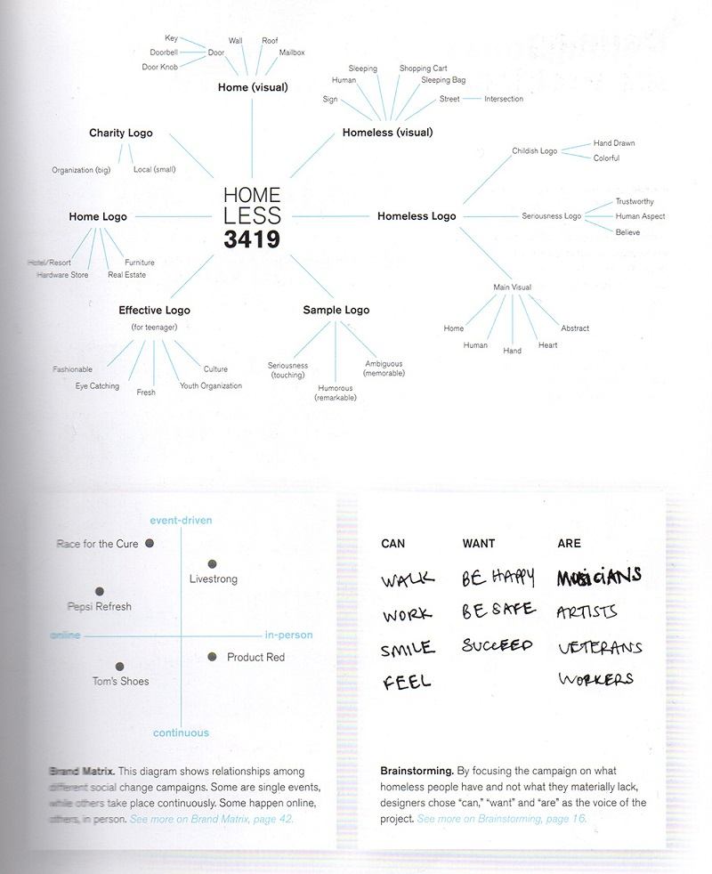
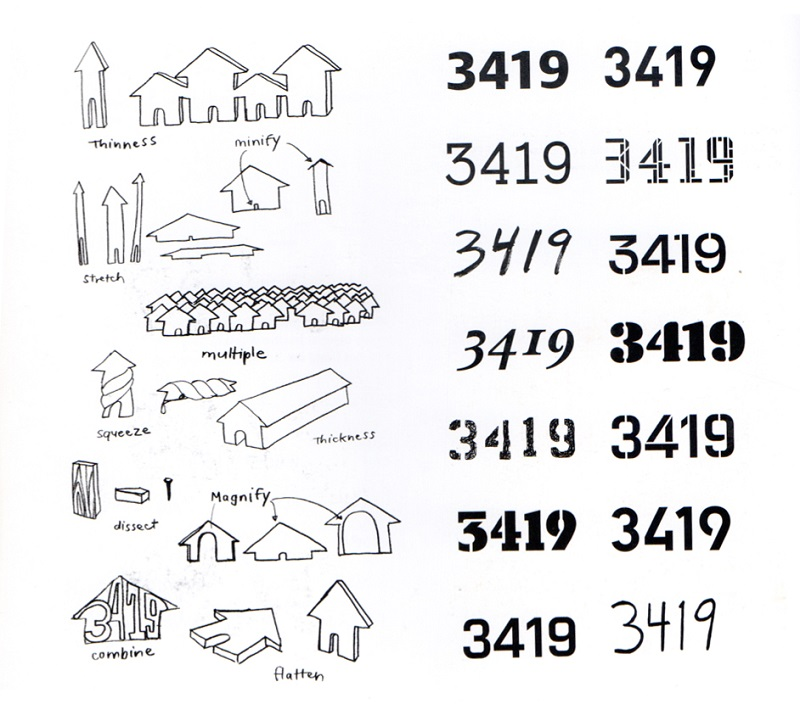
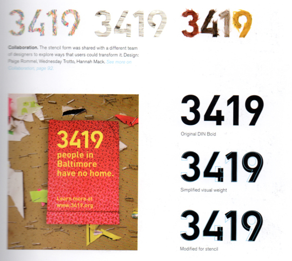
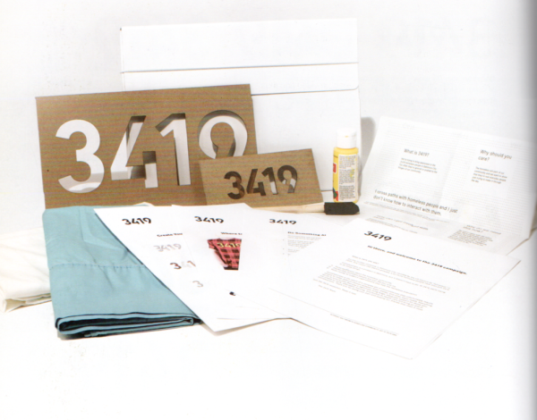
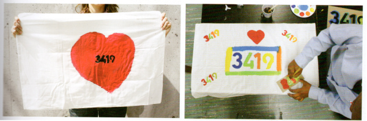

设计是用来解决问题。对于设计师来说这是再熟悉不过了，但是到底要解决什么问题本身就是一个问题。大家都会提问，但是如何提出有探索性的问题，是非常难的。牛逼项目往往从一个好问题开始。我在伦敦研究生一年中，都在研究如何找到研究问题，问题方向找对了，答案也更有方向了。

设计流程是一个直觉与深思熟虑相融合的行动。这篇文章将根据一个现有案例来分析设计流程的每一个阶段，从定义一个的研究问题到获得创意到设计执行。在沿着这个方向走的同时，组建设计团队需要的是多方面的人才，例如项目管理，文案，策划，设计，商务等等。接下来要介绍的这个项目是MICA平面设计研究生的研究项目。这个项目是由设计师Jennifer Cole Phillips为客户Charlie Rubenstein所设计的，目的是提升对本地社区无家可归的人的关注，是一个社会性很强的项目。对于无家可归的人这个范畴来说，是可以涉及到的范围是非常广泛的，上到政府政策下到衣服穿着，设计团队需要做的是先明确设计目的，缩小研究的范围，创造一个核心价值点来传达设计理念。

在2008年，设计团队在Baltimore城市访问了3419位居住空间特别受限的流浪汉。他们的研究问题是如何提高对这3419个没有住所的流浪汉的关注。设计团队根据这3419个人筹划了一场活动，单单只是针对了他们的住所问题。在这里必须插一句，一个设计解决一个问题就够了。这个项目的目的让在校小学生更好了解这一个群体。目的明确，受众清晰，下面是具体的操作方式。

## 1. 定义问题：

找问题的一个好办法就是采访。设计师通过与客户的访谈，和对洞察无家可归的人的内心需求来寻找切入点。有些客户和受众是不清楚自己需要做的是什么，作为专业的设计师，在客户或者受众访谈的过程中，必须具有敏锐洞察力，例如对客户和受众情绪的理解，从他们的姿势，动态，语速判断抓取当下的内容是不是客户在意的，是不是有价值。例如设计师在客户情绪激动的时候就抓到了几个有价值的信息：客户对现有的流浪汉服务非常不满意，政策十分单一而且不是每天都有能提供帮助，他并提出了希望设计一个以人为出发点的项目。客户觉得，他们这个项目在谈论的就是人，而且他们每个人又非常不一样，但如果他们尝试去理解每个人，他们来自哪里，他们的名字等等。客户希望做一个长达6个月的研究，采访他们每个人，而且不只采访一次，是一个长期过程，那么，设计师和客户将能慢慢了解他们的受众。

设计思维导图是将调研过程中有用的信息整合在一起，不管是设计理念，核心词汇或者视觉元素等等。设计师以Homeless（无家可归的人）为核心出发，收集与其相关的内容和视觉元素，例如“家”元素就要钥匙，门把，墙，地板，邮箱等；无家可归的人的视觉形象是：粉笔标示，睡觉，睡袋，街道等；对于logo，家的logo有旅馆，家具，房地产等；对小学生的视觉logo应该是：吸引眼球的，新奇的，有时尚感的；所以对于将要设计的品牌logo设计方向的主视觉可以包含是：“家”“人”“手”“心”“抽象”等。

品牌坐标轴是定位品牌一个有效方式，设置X,Y轴的属性后，将自身品牌在其位置标明出来，并与相类似的设计或者产品在同个坐标一起标记、对比，可以更好的拉开与现有设计的区别，这个方法在商业设计中也经常被用到。

设计师做头脑风暴时选了三个词来思考无家可归的人的需求：“can”“want”“are”也就是他们能做什么，想做什么，他们是什么这三个问题，从而深入的研究受众需求。

## 2. 获得创意：

a. 视觉脑暴：一个快速又有趣地获取视觉概念创意的方法。从一个视觉符号开始，如“房子”，设计师通过对房子的视觉形态不断演变，如多个重复的，扁平化的，三维的等等，这是相当于视觉上的头脑风暴。

b. 视觉穷尽：设计师以“3419”为这次活动的主题名字，选取一系列不同的数字字体样式，把符合主题视觉感受的全部字体都找出来，摆在一起，挑选出其中最适合的字体视觉样式。

## 3. 设计执行：

a. Mock-Ups：也就是我们常说的“融图”，对品牌设计师来说是再熟悉不过了。把设计稿做出精致的实物效果图，是作品打样前重要的一步，能更好的呈现出设计作品未来的真实样子。

b. 设计师对现有字体的调整，在上一步视觉穷尽中，他们选择了字体DIN，但是一般字库的字体是比较中性的，很难完全匹配设计的需求，这时就需要设计师把握好前面几步总结好的设计调性，根据其调性来调整字体，使其风格、性格与设计理念相匹配。

c. 设计师设计了海报和活页练习题来教育小孩关于Baltimore这个城市的流浪汉，同时告诉学生们他们能为流浪汉做什么。这是一套小工具的设计，里面还包含两个漏字板，两个枕头套，一瓶油漆和一把刷子，这些工具让让小学生们去创造他们的枕套海报，激发他们流浪汉现状的思考和如果睡觉没有床会是什么样的等等。

设计是一个一直在持续的过程，在设计师设计出这套小工具后，他们开始测试，应用这套工具。他们在小学里举行“3419”这个活动，当小学生们用这套工具创造他们自己的作品时，设计师与他的目标受众进行了直接互动，而小学生们创造出来的东西，也直接变成了这个设计的最终视觉形象，是一个持续不断的设计过程。
