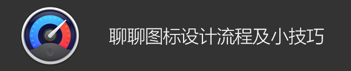
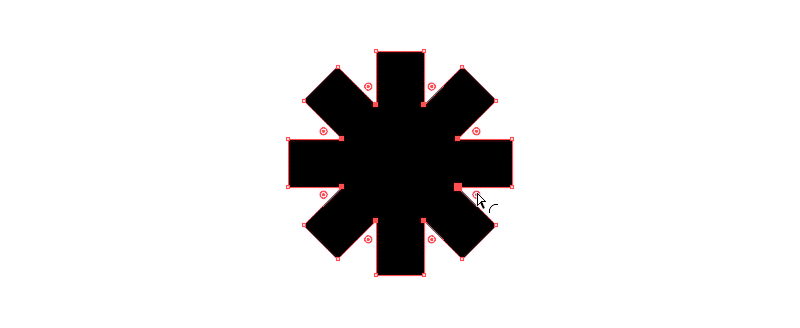

图标设计要求熟练运用软件，涉猎各种矢量特性、蒙板以及构造实体几何，因此，会需要同学们运用不同的软件工具与技巧，今天的译文全都是超实用的技巧干货，周末来补充点有料的。


## 图形创建 vs 图形样式

我认为，对矢量路径的创建和图形样式的设定作出正确的区分是十分重要的，因为它们需要通过两种截然不同的设计软件来实现——Photoshop 和 Illustrator。

Photoshop 的渲染质量和蒙板功能几乎超越了所有的设计软件，而 Illustrator 则囊括了丰富的矢量功能。在我的漫漫图标征途中，Illustrator 可谓是矢量路径界的王者。

值得庆幸的是，Photoshop 和 Illustrator 两者之间的转换算得是无缝连接了。通常我的工作流程是这样的：在 Photoshop 中进行简单图形操作，但如果涉及到整套图标或任何复杂图形，我会先选用 Illustrator 进行创建，而后移步 Photoshop 进行样式处理。

简而言之，Illustrator 用于创建图形，Photoshop 用于设定样式及输出。

## 规格

如果你可以控制图标尺寸，那么图标样式和线条粗细应有助于规格的制定，因为许多图标都必须有一条中线。也就是说，如果一个图标的宽度为偶数，那么中线的宽度便不能为奇数。同理，如果一个图标的宽度为奇数，那么其中线的宽度便不可为偶数。


当你使用的线条宽度为偶数时，图标尺寸应为：偶数（宽）x 偶数（高）。当线条宽度为奇数时，那么图标尺寸应为：奇数（宽）x 奇数（高）。

尽可能不要混合使用奇数和偶数尺寸（除非你不混合会抓狂，那么也确保不同轴使用不同粗细的线条）。

勿用高分别率来掩盖这个问题——在奇数宽度的图标中使用1pt（或 1dp）的线条，也许在 Retina 配置中看起来没有问题，但绝对会在1× 和 3× 尺寸的分辨率中发现让你头大的问题。

其实，大家只要把所有的点都想象成图标的基础网格，避免过于细小的偏移定位，一切也没那么复杂。要确保所有的图标设计应该从 1× 开始。

## OS X 应用图标

使用简单的网格系统可有助应用图标的绘制。OS X 的应用图标尺寸均为成倍增长，因此，我可以通过 16×16 像素的图标大致界定 1024×1024 图标的定位，这样的工作流程就轻松多了。对于那些极小的版本，也就无需过多调整细节了。


然而，苹果的图标并没有完全吻合网格系统。不知为何，它们有着几个像素的偏差——Safari 图标的直径为 898 像素，而非完全吻合 1/16 网格的 896 像素。


综上所述，我定义的图标尺寸与 Safari、iTunes和其它苹果图标并不完全相同，不过只是 1024 像素中的 2 像素差别而已，遵循网格对我来说更为重要。很好奇苹果为何选择这个尺寸。

## iOS 应用图标

iOS 应用图标的尺寸不如 OS X 图标那么具有匹配度，工作流程略微复杂一些。以下所列为如今所有 iOS 图标的尺寸。

```
•   29×29  
•   40×40  
•   58×58  
•   76×76  
•   80×80  
•   87×87  
•   120×120  
•   152×152  
•   180×180  
•   1024×1024（应用商店）
```

目前总共有 10 种尺寸。但是，如果你只需制作 1x 的网格尺寸，那就只需关注 5 种主要尺寸即可。

```
•   29 (1×), 58 (2×), 87 (3×)  
•   40 (1×), 80 (2×), 120 (3×)  
•   60 (1×), 120 (2×), 180 (3×)  
•   76 (1×), 152 (2×), 228 (3×)  
•   1024×1024（应用商店）
```

4 种基础尺寸加上应用商店尺寸 1024×1024 像素，工作量直线减半。另有一个好消息，要是哪天苹果发布 3x 尺寸的 iPad，那你基本也已经完成了适合该规格的图标。


在一开始，要忍住高分辨率尺寸的诱惑，专注于 1x 尺寸是事半功倍的良方，这可以帮助我们节省时间，从而获得更有效，更易维护的设计。当水到渠成时，再开始制作 2×、3× 或 4× 的版本也不迟。

特别要谨慎使用“智能对象”，要小心它们可能有特殊的尺寸变化。

## 从 Illustrator 开始

Illustrator 不但能让你在设计 1x 网格尺寸的图标时清晰观察所有矢量节点，并且有着数不胜数在任何其它软件中都无法实现的独特功能。我对其中的许多功能真是欲罢不能，这也正是为什么我选择 Illustrator

## 对齐网格设定

我不太喜欢 Illustrator 的对齐像素设定，不过勾选“视图→对齐网格”后的效果还是非常理想的，记得关闭对齐新对象到像素。对齐新对象到像素可在新建文档或变换面板中可找到。


如果你需要对像素作非常细微的调整，可以使用移动面板（对象 → 转换 → 移动，或直接按回车键）。


## 自定义工具面板

最近，我重新编辑了我的工具面板，去掉一些不常用的工具，显示原本被隐藏的工具。


## 路径寻找器

如果你想对图形进行加、减或排除操作（通常被称为布尔操作或构造实体几何），Illustrator 中的路径寻找器可谓是所有矢量编辑软件中最好用的功能了。

于路径寻找器中，我又最钟爱分割功能——它将重叠的图形分割成单独的形状，这样就可以轻易地删除不需要的部分。


## 形状生成器

形状生成器功能比路径寻找器更新，使用起来更快捷。如果你有几个独立形状互相重叠，那么选中形状生成器，拖动鼠标即可组合形状，按住 option 同时拖动鼠标即可减去形状。


⇧M 选择形状生成器。

## 实时圆角

Illustrator CC 2014 新添加了实时圆角功能，像小手柄一样出现在所有转角处。拖动小手柄即可控制圆角的角度。这个功能不仅仅针对矩形，适用于所有形状。



实时圆角功能实现了那些原本绘制十分困难或费时的图形。Illustrator 的这款功能一如许多其它可爱的功能，方便了设计师们的工作。


如果你希望精确定义角度，可以在控制面板中的输入转角直径数值即可。


## 扭曲

Illustrator 的扭曲以及其它封套扭曲工具可用于各种形状的弯曲和扭转，让图形变得更有趣。


## 路径轮廓

我通常会先将笔触转路径后，再进入 Photoshop 设定样式。有些软件也有这个功能，但是不多。对我来说，该功能是矢量编辑软件必不可少的。


## 笔触变量

在 Illustrator 中，我们可以对笔触各个部位的宽度进行调整。


选择宽度工具（shift-W），双击需要编辑的节点后，会出现控制面板供输入数据精确控制宽度。该工具可以精准绘制出其它工具所无法绘制的图形。


## 虚线

Illustrator 中的虚线有两种模式——转角对齐以及常规间隔。转角对齐虚线总是看起来更舒服，然而多数设计软件里并不包含这一选项。虚线可转化为路径后置入 Photoshop 中作后续编辑。


## 单个变换

在 Illustrator 中，同时对多个对象进行大小、旋转角度及位移等调整是相当轻松的，并且它还能做到以每个单独物体为单位进行上述各类调整。这个小小的功能可以为我们省去大量的时间和精力。


## 套索选择

当选取框无法满足复杂的选区时，套索工具可以做到。可与按键结合使用套索工具：（加选）， （减选）。


## 图形样式

为提高工作效率，我在 Illustrator 中设定了一些图形样式。如果你的图标中含有很多图形样式相同的元素，这么做一定能帮你节省不少时间。


## 像素预览

说实话，Illustrator 的像素预览图挺烂的，案例图中显示了它究竟是怎么个烂法——像素零散，没有渐变递色，等等这些都让它的像素预览无法令人信服。因为我最终会在 Photoshop 里进行样式设定，所以 Illustrator 的像素预览对我并没有什么影响，但我们还是要对这一特点有所知晓。

大家可以在图中看到 Illustrator 和 Photoshop 的像素预览图对比，差异相当明显。


零星的像素是很危险的，iOS 和 OS X 界面图像的规格须为精确成倍的数据，所以一个图像所多出的1个零散像素就会出现问题。

## Photoshop 样式设定

一旦完成图标的路径构建后，我会将他们作为形状涂层贴入 Photoshop。如果你有多个路径，可以在 Illustrator 中将它们同时选中拷贝，在贴入 Photoshop 后仍可以分为单独图层。单独选中一个路径，并同时按⇧⌘J键，即可将其移入一个新图层。

## 输出

我不建议通过 Illustrator 输出位图。

我亦不将 iOS 图标存为 PDF 格式。

我使用 Photoshop 切片来输出 PNG 格式或其他位图格式。这一做法有诸多好处，譬如：可以选用一张需 10 秒载入的图层，或是一整套需 100 秒载入的图标；保持样式的整体性；易编辑。（原作者另著有一篇应用设计流程，其中录入了更多有关切片工具的详情，如果童鞋们有兴趣，小编可以进行后续编译。）如果是输出 SVG 格式，我通常结合使用 Photoshop 的生成器和 Illustrator。
