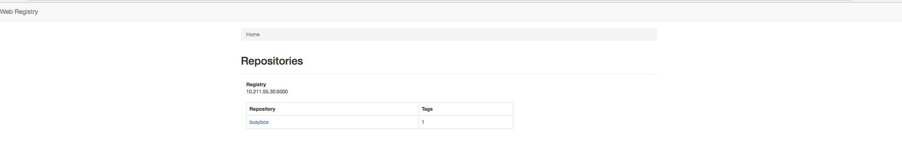

### 一：准备

**关闭防火墙**

```

# systemctl stop firewalld.service   # 关闭
# setenforce 0

# getenforce
Permissive   #为正常
```


### 二：搭建镜像仓库

**拉取镜像**

```
docker pull registry:2.5.2
```

**启动**

```
docker run -d -p 5000:5000 --restart always --name registry docker.io/registry:2.5.2
```

**验证**

```
# curl http://10.211.55.30:5000/v2/_catalog
{"repositories":[""]}
```

**推送到镜像仓库**

```
# docker tag busybox 10.211.55.30:5000/busybox

# docker push 10.211.55.30:5000/busybox

# curl http://10.211.55.30:5000/v2/_catalog
{"repositories":["busybox"]}
```

### 三：安装docker-registry-web

**下载docker-registry-web**

```
docker pull docker.io/hyper/docker-registry-web
```

**启动**

```
docker run -d -p 8080:8080 --name registry-web --link registry  -e REGISTRY_URL=http://10.211.55.30:5000/v2 -e REGISTRY_NAME=10.211.55.30:5000 docker.io/hyper/docker-registry-web
```

**访问**

```
http://10.211.55.30:8080/
```



### 四:配置带用户权限的registry

到上面为止，registry已经可以使用了。如果想要控制registry的使用权限，使其只有在登录用户名和密码之后才能使用的话，还需要做额外的设置。
registry的用户名密码文件可以通过htpasswd来生成：

```
mkdir /opt/registry-var/auth/  
docker run --entrypoint htpasswd registry:2.4.1 -Bbn felix felix  >> /opt/registry-var/auth/htpasswd  
```

上面这条命令是为felix用户名生成密码为felix的一条用户信息，存在/opt/registry-var/auth/htpasswd文件里面，文件中存的密码是被加密过的。
使用带用户权限的registry时候，容器的启动命令就跟上面不一样了，将之前的容器停掉并删除，然后执行下面的命令：

```
docker run -d -p 5000:5000 --restart=always \
-v /opt/registry-var/auth/:/auth/ \
-e "REGISTRY_AUTH=htpasswd" \
-e "REGISTRY_AUTH_HTPASSWD_REALM=Registry Realm" \
-e REGISTRY_AUTH_HTPASSWD_PATH=/auth/htpasswd \
-v /opt/registry-var/:/var/lib/registry/ \
registry:2.5.2
```

这时，如果直接想查看仓库信息、pull或push都会出现权限报错。必须先使用docker login 命令来登录私有仓库：

```
docker login 10.211.55.30:5000
```

根据提示，输入用户名和密码即可。如果登录成功，会在/root/.docker/config.json文件中保存账户信息，这样就可以继续使用了。
