# dubbo简单教程
## 目录
<pre>
简介
环境准备
下载和导入github上dubbo代码
使用maven打包dubbo工程
介绍dubbo框架
安装zookeeper集群
监控中心安装
管理员控制台安装
运行provider
运行consumer
运行自己的Demo
</pre>

## 简介
本例子不牵涉复杂的运行原理的解释，只是教初学者怎样使用dubbo框架，如果后续自己感兴趣的话可以自行的研究其中的原理

## 环境准备

**开发环境：** eclispe

**依赖插件：** eclipse maven插件、eclipse github插件

**备注：** 如果不会安装maven插件的话可以自行的百度。

## 下载和导入github上dubbo代码

1. 下载github上dubbo代码

**github上dubbo地址：**

<pre>https://github.com/alibaba/dubbo  </pre>

2. 获得下载地址,见下图


3. 导入到eclipse中，步骤如下

**import->Git->Projects from Git->Clone URI->在RUL中粘贴github在dubbo上的地址，目前为：https://github.com/alibaba/dubbo.git->点击下一步->选择import as general project，下一步->输入Project name 点击Finish**

操作截图如下

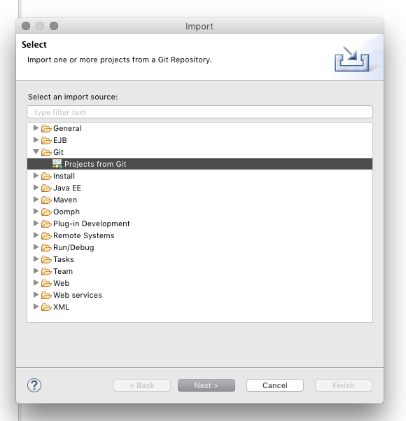

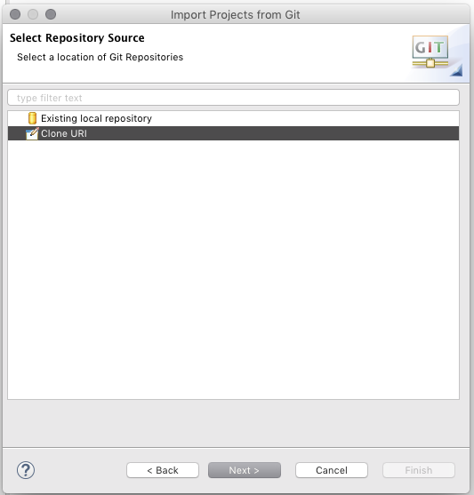

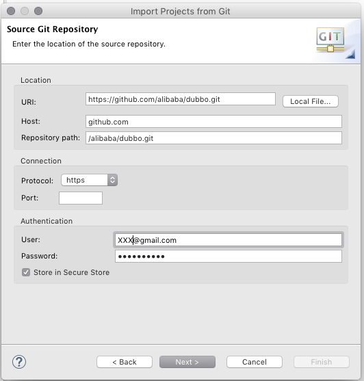

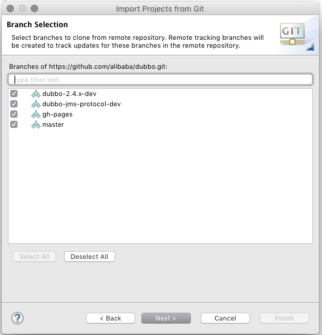

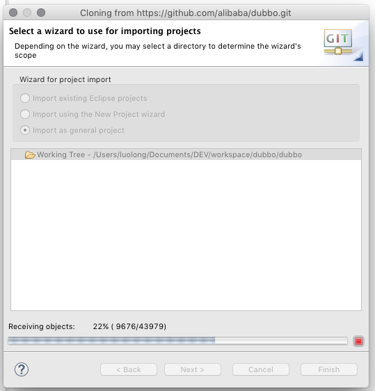

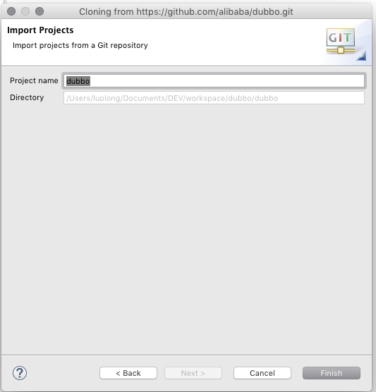

4. 目前为止dubbo中的代码已经导入进去了，截图如下

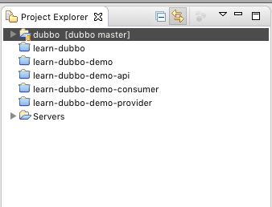

但是不是我们经常看见的maven项目，只需要最后一步就操作完成了，步骤

**import -> Maven -> Existing Maven Projects ->选择未被选中的dubbo/pom.xml中的那个，点击Finish**

截图如下


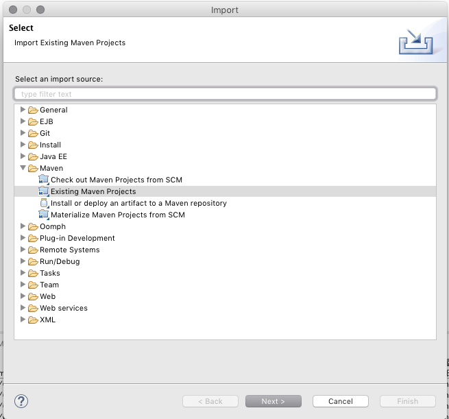

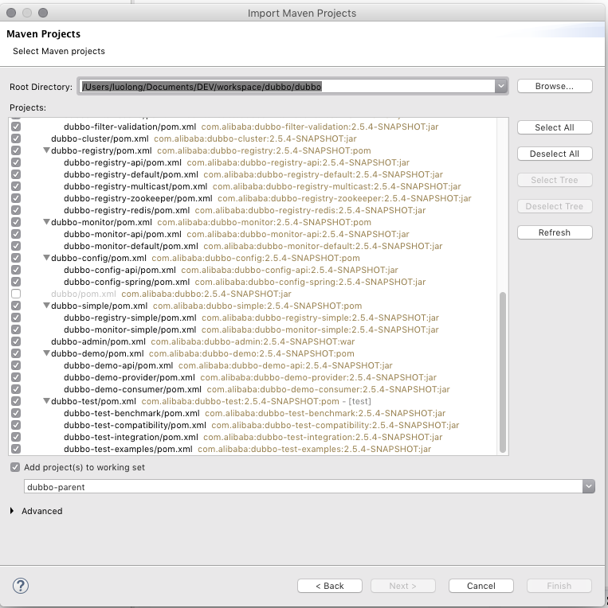

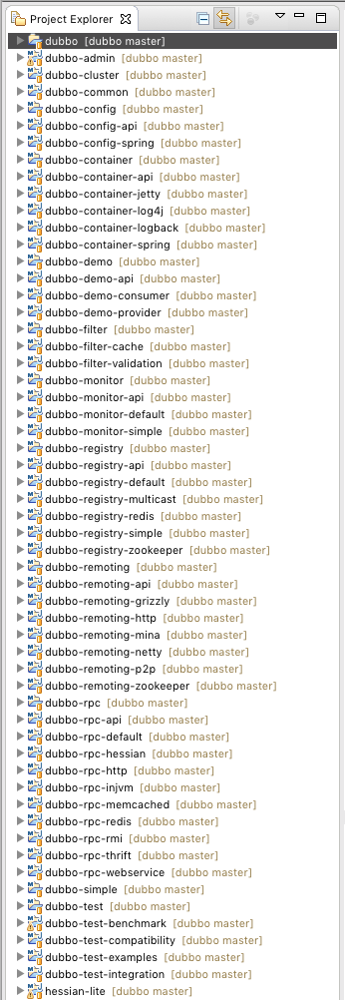

到现在为止熟悉的界面回来了，导入代码完成。

## 使用maven打包dubbo工程

1. 先clean 和update Project一下工程。

2. 使用maven clean install一下，Goals输入参数：clean install -Dmaven.test.skip,有两个作用

一是：将缺失的jar包安装到maven仓库中，例如dubbo-xx.jar。

二是：打下各个工程的包，一会儿要用。

截图如下

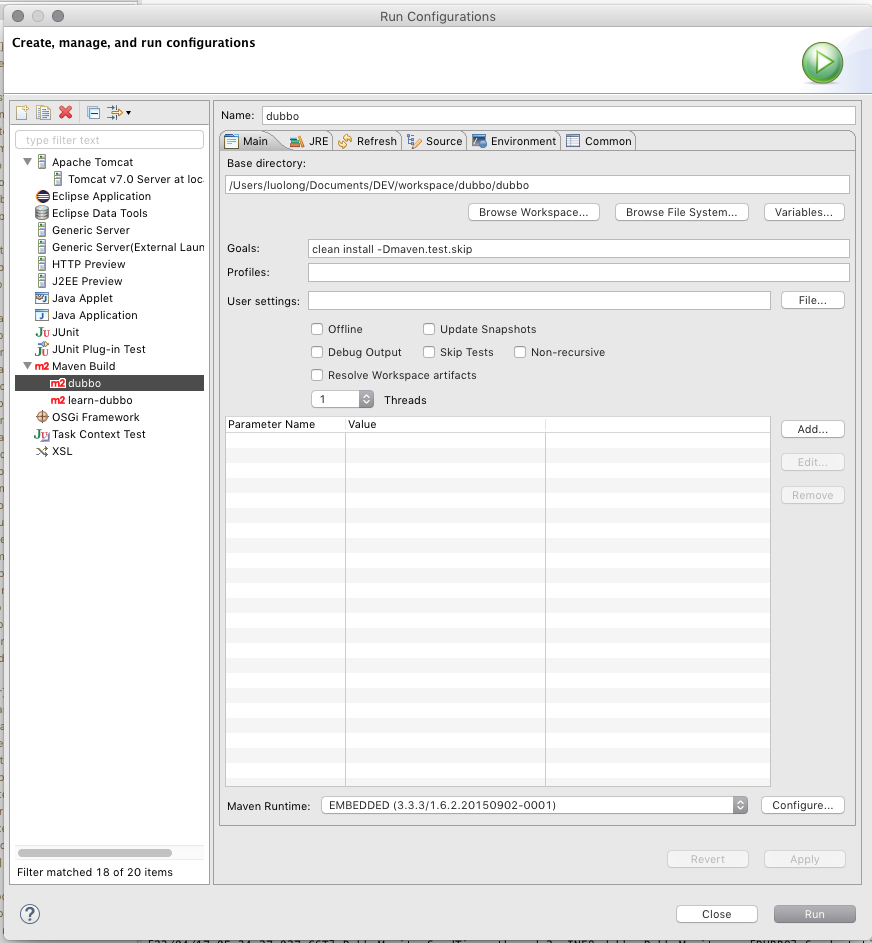

如果看到下边截图证明大功告成

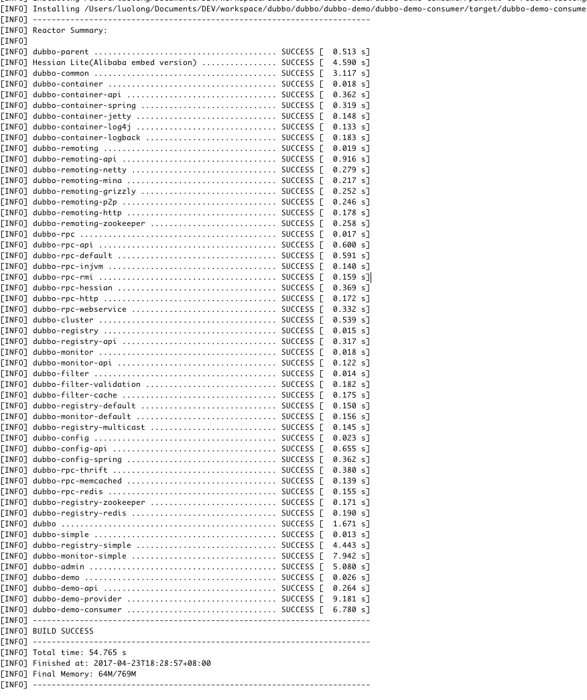

**截止目前为止前期准备工作已经完成**

## 介绍dubbo框架
最简单的dubbo框架需要三部分<br/>
1. **注册中心：** 这次使用zookeeper集群 

2. **管理中心：** 这次使用的是刚才打包的dubbo-admin-2.5.4-SNAPSHOT,这个是web程序使用tomcat启动

3. **监控组件：** 这次使用刚才打包的dubbo-monitor-simple-2.5.4-SNAPSHOT是监控程序，这个是java程序直接用脚本启动就行  

4. **生产者服务端：** 这是使用刚才打包的dubbo-demo-provider-2.5.4-SNAPSHOT，这个是java程序直接用脚本启动就行
 
5. **消费者客户端：** 这次使用刚才打包的dubbo-demo-consumer-2.5.4-SNAPSHOT，这个是java程序直接用脚本启动就行


简单的运行流程为先启动注册中心zookeeper集群，然后启动管理中心者里边有可视化的管理界面，然后启动监控组件这里边也有可视化的监控界面，再启动生产者服务端，他会向注册中心注册自己的服务，同时在管理中心界面中可以看见，最后启动消费者客户端，会通过注册中心查找合适的服务进行远程调用消费。

## 安装zookeeper集群
1. 去官网下载zookeeper压缩包,下载解压，

<pre>http://www.apache.org/dyn/closer.cgi/zookeeper/</pre>
解压到3个目录（模拟3台zk server）：
<pre>

zookeeper-1
zookeeper-2
zookeeper-3
</pre>

2. 创建每个目录下conf/zoo.cfg配置文件<br/>zookeeper-1/conf/zoo.cfg 内容如下：

<pre>
tickTime=2000
initLimit=10
syncLimit=5
dataDir=/home/hadoop/tmp/zk1/data //填写自己的路径
dataLogDir=/home/hadoop/tmp/zk1/log  //填写自己的路径
clientPort=2181
server.1=localhost:2287:3387
server.2=localhost:2288:3388
server.3=localhost:2289:3389
</pre>

zookeeper-2/conf/zoo.cfg 内容如下：

<pre>
tickTime=2000
initLimit=10
syncLimit=5
dataDir=/home/hadoop/tmp/zk2/data  //填写自己的路径
dataLogDir=/home/hadoop/tmp/zk2/log  //填写自己的路径
clientPort=2182
server.1=localhost:2287:3387
server.2=localhost:2288:3388
server.3=localhost:2289:3389
</pre>

zookeeper-3/conf/zoo.cfg 内容如下：

<pre>
tickTime=2000
initLimit=10
syncLimit=5
dataDir=/home/hadoop/tmp/zk3/data
dataLogDir=/home/hadoop/tmp/zk3/log
clientPort=2183
server.1=localhost:2287:3387
server.2=localhost:2288:3388
server.3=localhost:2289:3389
</pre>

注：因为是在一台机器上模拟集群，所以端口不能重复，这里用2181~2183，2287~2289，以及3387~3389相互错开。另外每个zk的instance，都需要设置独立的数据存储目录、日志存储目录，所以dataDir、dataLogDir这二个节点对应的目录，需要手动先创建好。

另外还有一个灰常关键的设置，在每个zk server配置文件的dataDir所对应的目录下，必须创建一个名为myid的文件，其中的内容必须与zoo.cfg中server.x 中的x相同，即：

<pre>
/home/hadoop/tmp/zk1/data/myid 中的内容为1，对应server.1中的1
/home/hadoop/tmp/zk2/data/myid 中的内容为2，对应server.2中的2
/home/hadoop/tmp/zk3/data/myid 中的内容为3，对应server.3中的3
</pre>

生产环境中，分布式集群部署的步骤与上面基本相同，只不过因为各zk server分布在不同的机器，上述配置文件中的localhost换成各服务器的真实Ip即可。分布在不同的机器后，不存在端口冲突问题，可以让每个服务器的zk均采用相同的端口，这样管理起来比较方便。


3. 启动验证 

<pre>
zookeeper-1/bin/zkServer.sh start
zookeeper-2/bin/zkServer.sh start
zookeeper-3/bin/zkServer.sh start
</pre>

启用成功后，输入 jps 看下进程

<pre>
20351 ZooKeeperMain
20791 QuorumPeerMain
20822 QuorumPeerMain
20865 QuorumPeerMain
</pre>

应该至少能看到以上几个进程。
可以启动客户端测试下：

<pre>
bin/zkCli.sh -server localhost:2181
</pre>

(注：如果是远程连接，把localhost换成指定的IP即可)
成功后，应该会进到提示符下，类似下面这样:

<pre>
[zk: localhost:2181(CONNECTED) 0]  
</pre>

## 监控中心安装
进入dubbo-simple/dubbo-monitor-simple/target目录，可以看到dubbo-monitor-simple-2.5.4-SNAPSHOT-assembly.tar.gz文件。

<pre>
tar -zxvf dubbo-monitor-simple-2.4.10-assembly.tar.gz
</pre>

解压后进入目录，
vim conf/dubbo.properties
修改注册中心的配置，注释掉广播地址，改为zookeeper作为注册中心，

<pre>
注释dubbo.registry.address=multicast://224.5.6.7:1234
放开dubbo.registry.address=zookeeper://127.0.0.1:2181
</pre>

其它参数如有需要可自行修改。（注意：如果是本机测试，将monitor和admin都装倒一台机器上时，可以将dubbo.jetty.port=8083）
执行：

<pre>
sh bin/start.sh
</pre>

可启动mointor。访问地址：http://127.0.0.1:8083 (默认为8080，8083是修改后的值)
截图如下

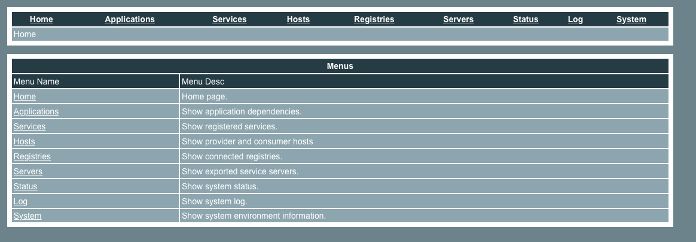

## 管理员控制台安装
进入源码编译目录，进入到dubbo-admin/target，可以看到dubbo-admin-2.5.4-SNAPSHOT这个文件夹。这是web项目，需要运行在web容器下，我这里是运行到tomcat下。这个默认使用zookeeper作为注册中心的，不过配置的本机地址，如果需要修改为其他ip，只需修改WEB-INF/dubbo.properties下的配置地址即可。

<pre>
dubbo.registry.address=zookeeper://127.0.0.1:2181
</pre>

启动tomcat即可,(根据自己的tomcat配置来访问)访问地址：

<pre>http://127.0.0.1:8080/dubbo-admin-2.5.4-SNAPSHOT</pre>

默认账号密码为root，进入之后的截图如下

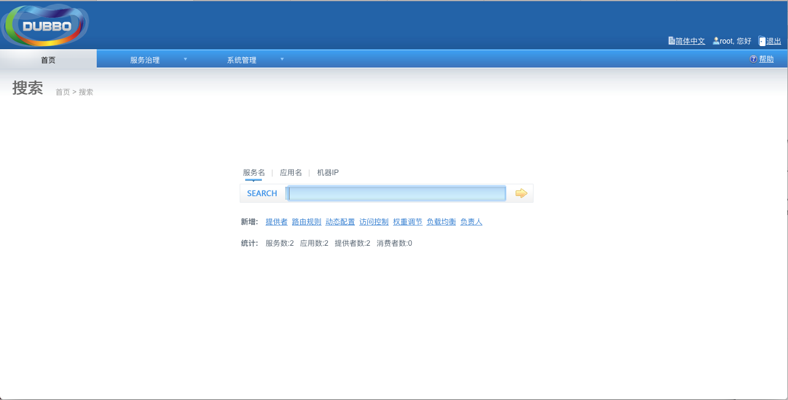

可以去服务治理里边看相关的服务。

## 运行provider
进入dubbo-demo/dubbo-demo-provider/target，

<pre>
tar -zxvf dubbo-demo-provider-2.5.4-SNAPSHOT-assembly.tar.gz
</pre>

修改注册中心的配置地址为zookeeper，如下：

<pre>
注释dubbo.registry.address=multicast://224.5.6.7:1234
放开dubbo.registry.address=zookeeper://127.0.0.1:2181
</pre>

执行

<pre>
sh bin/start.sh
</pre>

来启动provider服务。

可以查看管理员控制台看到新启动的服务

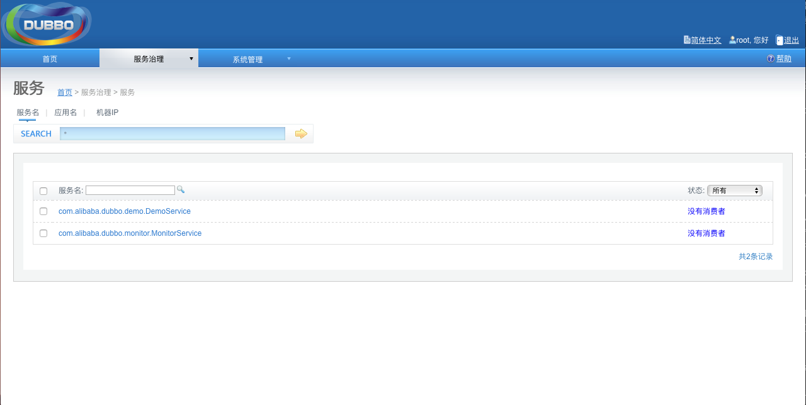

## 运行consumer
进入dubbo-demo/dubbo-demo-consumer/target

<pre>
tar -zxvf dubbo-demo-consumer-2.5.4-SNAPSHOT-assembly.tar.gz
</pre>

修改注册中心的配置地址为zookeeper,如下

<pre>
注释dubbo.registry.address=multicast://224.5.6.7:1234
放开dubbo.registry.address=zookeeper://127.0.0.1:2181
</pre>

执行

<pre>
sh bin/start.sh
</pre>

来启动consumer服务，可以查看管理员控制台看到新启动的服务。

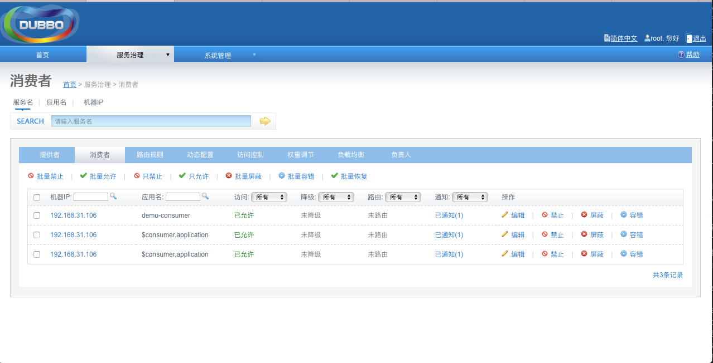

## 运行自己的DEMO
下载样例文件：

<pre>
https://github.com/wudixiaowei/learn-dubbo.git
</pre>

### 运行服务端
运行learn-dubbo-demo-provider项目中的Main.java类的服务端，运行结果为

<pre>
System.in.read 开始
</pre>
管理员控制台界面总会出现org.learn.dubbo.demo.api.ShwoNameService服务

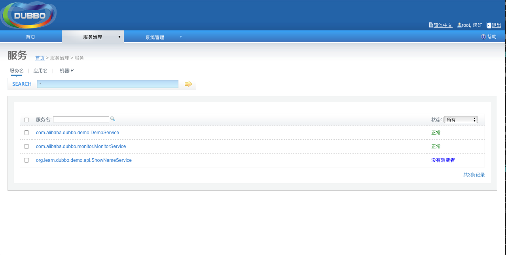

接下来大概讲解相关代码

接口服务

**ShowNameService.java**


<pre>
package org.learn.dubbo.demo.api;
public interface ShowNameService {
	String showName(String name);
}
</pre>

服务端实现类

**ShowNameServiceImpl.java**

<pre>
package org.learn.dubbo.demo.provider;
public class ShowNameServiceImpl implements org.learn.dubbo.demo.api.ShowNameService {
	static int i = 0;
	public String showName(String name) {
		System.out.println("服务端执行了 " + i );
		i++;
		return "名称为  " + name;
	}
}
</pre>

声明接口ShowNameService和实现类ShowNameServiceImpl.java 

**provider.xml**


```
<?xml version="1.0" encoding="UTF-8"?>
<beans xmlns="http://www.springframework.org/schema/beans" xmlns:xsi="http://www.w3.org/2001/XMLSchema-instance" xmlns:dubbo="http://code.alibabatech.com/schema/dubbo" xsi:schemaLocation="http://www.springframework.org/schema/beans http://www.springframework.org/schema/beans/spring-beans-2.5.xsd
		http://code.alibabatech.com/schema/dubbo http://code.alibabatech.com/schema/dubbo/dubbo.xsd">

	<bean id="showNameService" class="org.learn.dubbo.demo.provider.ShowNameServiceImpl" />

	<dubbo:service interface="org.learn.dubbo.demo.api.ShowNameService" ref="showNameService" />
</beans>
```

资源文件方式配置服务

**dubbo.properties**

<pre>
dubbo.container=log4j,spring
dubbo.application.name=learn-dubbo-demo-provider  //暴露服务名称
dubbo.application.owner=
dubbo.registry.address=zookeeper://127.0.0.1:2181  //注册中心地址
dubbo.monitor.protocol=registry  //协议
dubbo.protocol.name=dubbo  //协议方式，这里用的是dubbo
dubbo.protocol.port=20882  //暴露端口
dubbo.service.loadbalance=random  //负载方式这里是随机
dubbo.log4j.file=logs/dubbo-demo-provider.log //日志记录位置
dubbo.log4j.level=WARN
</pre>

### 运行消费端
运行learn-dubbo-demo-consumer项目中的Consumer.java类的服务端，运行结果为

<pre>
名称为  张三
</pre>

管理员控制台界面总会出现earn-dubbo-demo-consumerx 消费者

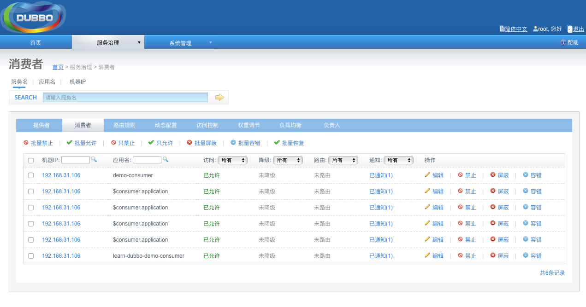

接下来简单讲解下消费端相关代码

消费端实现类

**Consumer.java**

<pre>
package org.learn.dubbo.demo.consumer;
import org.learn.dubbo.demo.api.ShowNameService;
import org.springframework.context.support.ClassPathXmlApplicationContext;
public class Consumer {
	public static void main(String[] args) {
		ClassPathXmlApplicationContext context = new ClassPathXmlApplicationContext("classpath:consumer.xml");
		context.start();
		ShowNameService demoService = (ShowNameService)context.getBean("showNameService"); // 获取远程服务代理
		while(true){
			String hello = demoService.showName("张三"); // 执行远程方法
			System.out.println(hello);
			try {
				Thread.sleep(2000);
			} catch (InterruptedException e) {
				e.printStackTrace();
			}
		}
	}
}
</pre>

声明远程接口

**consumer.xml**


```
<?xml version="1.0" encoding="UTF-8"?>
<beans xmlns="http://www.springframework.org/schema/beans"
	    xmlns:xsi="http://www.w3.org/2001/XMLSchema-instance"
	    xmlns:dubbo="http://code.alibabatech.com/schema/dubbo"
	    xsi:schemaLocation="http://www.springframework.org/schema/beans        http://www.springframework.org/schema/beans/spring-beans.xsd        http://code.alibabatech.com/schema/dubbo        http://code.alibabatech.com/schema/dubbo/dubbo.xsd">

	<!-- 生成远程服务代理，可以和本地bean一样使用demoService -->
	<dubbo:reference id="showNameService" interface="org.learn.dubbo.demo.api.ShowNameService"  />
</beans>
```

资源文件方式配置消费端服务
	
**dubbo.properties**
	
<pre>
	dubbo.container=log4j,spring
	dubbo.application.name=learn-dubbo-demo-consumer //消费端名称
	dubbo.application.owner=
	dubbo.registry.address=zookeeper://127.0.0.1:2181 //注册的服务
	dubbo.monitor.protocol=registry
	dubbo.log4j.file=logs/dubbo-demo-consumer.log
	dubbo.log4j.level=WARN
</pre>

到此为止我们已经能够运行起来一个简单的dubbo框架了，后续的dubbo组件的相关功能可以在此基础上进行学习了，接下来的学习文档可以参考阿里官方的文档，上边讲解的非常详细

**官方文档：**http://dubbo.io/User+Guide-zh.htm
