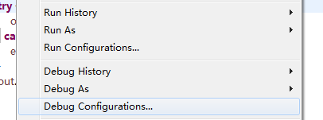
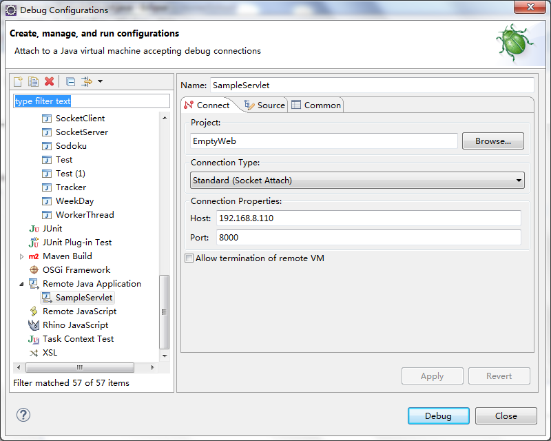
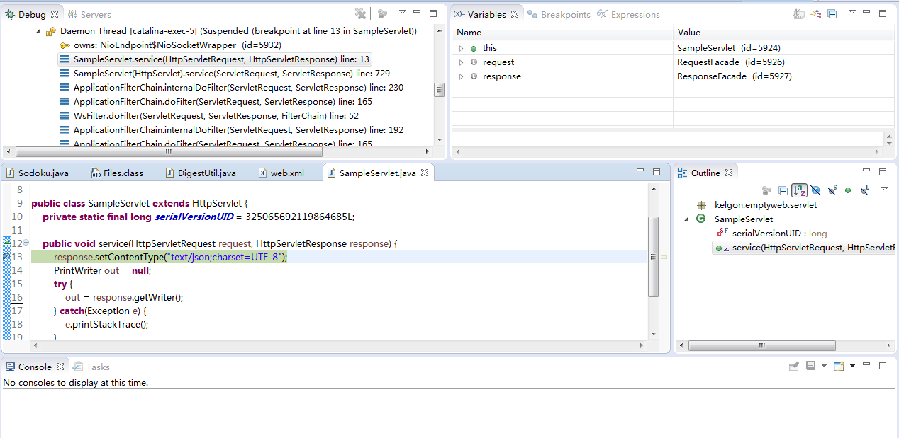

## 准备

1.Eclipse或其他支持远程调试的debug工具（在本地主机上安装）
2.Java运行环境（在运行被调试程序的远程主机上安装）

## 调试过程

启动被调试进程

需要被调试的进程，在启动命令中添加下列参数：

JDK 1.7及以上：

```
-agentlib:jdwp=transport=dt_socket,address=8000,server=y,suspend=n
```

JDK 1.6及以下：

```
-Xdebug -Xrunjdwp:server=y,transport=dt_socket,address=8000,suspend=n
```

参数说明：

* address：远程调试的端口号
* suspend：y/n，启动后是否挂起。如果指定为y，则被调试进程在启动后会挂起，直到有debug连接创建时再开始运行，主要用于调试程序的启动过程。通常在调试Web服务的时候，指定为n即可。

以使用JDK1.7的Tomcat为例，在catalina.sh中添加启动参数：

```
CATALINA_OPTS="$CATALINA_OPTS -agentlib:jdwp=transport=dt_socket,address=8000,server=y,suspend=n"
```

使用Eclipse进行远程调试

1.打开作为调试入口的类，如某某Servlet

2.Run -> Debug Configurations…



3.双击”Remote Java Application”，创建新的远程调试配置

4.填写工程名、Host和Port



5.点击”Debug”

6.在需要中断的位置添加断点（和在本地调试时一样）


7.触发远程需调试的服务执行（如通过浏览器访问某URL）


8.通过Eclipse进行调试（调试方法和在本地调试完全一样）



9.调试完成后，点击调试工具栏中的”Disconnect”断开调试连接


## 注意事项

1.只在需要调试时开启远程调试，不要将远程调试启动参数作为常规启动参数添加

2.从服务集群中选取1个实例开启远程调试即可

3.调试完成后注意断开调试连接
