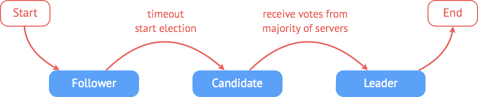

## etcd中raft机制一

首先，什么是etcd？看官方的定义：A highly-available key value store for shared configuration and service discovery. 翻译过来就是：用于配置共享和服务发现的K-V存储仓库。

特点：

* 简单：基于HTTP+JSON的API让你用curl就可以轻松使用。
* 安全：可选SSL客户认证机制。
* 快速：每个实例每秒支持一千次写操作。(比Redis性能差很多)
* 可信：使用Raft算法充分实现了分布式。

今天听了开发的分享，对etcd中使用raft协议(分布式强一致性日志协议)来保证数据一致性非常感兴趣。先上一个etcd的架构图：

一个 etcd 节点的核心由三部分组成：

* raft：raft 状态机，对 raft 共识算法的实现
* wal：raft 日志存储
* storage：数据的存储与索引

Wal (Write-ahead logging)，是用于向系统提供原子性和持久性的一系列技术，所有的修改在提交之前都要先写入 log 文件中。etcd 的wal 由日志存储与快照存储两部分组成，其中 entry 负责存储具体日志的内容，而 snapshot 负责在日志内容发生变化的时候保存 raft 的状态。Wal 会在本地磁盘的一个指定目录下分别日志条目与快照内容。

etcd 集群的工作原理基于 raft 共识算法。优点在于可以在高效的解决分布式系统中各个节点日志内容一致性问题的同时，也使得集群具备一定的容错能力。即使集群中出现部分节点故障、网络故障等问题，仍可保证其余大多数节点正确的步进。甚至当更多的节点（一般来说超过集群节点总数的一半）出现故障而导致集群不可用时，依然可以保证节点中的数据不会出现错误的结果。

raft算法的要求是选择一个节点作为leader， 客户端的读写操作都发往leader， leader先将请求记录在log中，然后再发送请求到follower，follower写入成功后返回给leader写入成功的消息，leader确认后才完成本次写入到磁盘中，最后返回给客户端写入成功的响应。leader通过心跳与follower保持通讯，如果leader异常，则重新选举leader，这是最正常的情况，但是，当网络异常时，leader无法与所有follower通讯，如下图所示：

此时raft 日志写入流程图：

此时主和从都只将客户端的请求存入本地log，未做持久化存储，返回给客户端失败或超时的响应。其他从节点将进行多数派的leader选举，此时如果客户端有新的请求，则将发给新的leader，新leader和follower完成多数派的写入工作。此时老leader和一个follower的数据与新leader组成的多数派不一致，通过心跳和term等机制判断更新老leader为follower，未持久化的数据将丢失。新leader将自己已存储但follower没有的数据再次发送一遍，保证从节点与主节点的数据一致性。

通过参加这次的etcd分享，对raft协议有了更清晰的认识，更多参考资料如下：

raft算法介绍：http://raftconsensus.github.io/

etcd中raft的应用：http://www.infoq.com/cn/articles/coreos-analyse-etcd
