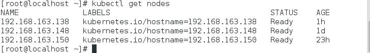

# kubernates安装教程


## master节点相关

```
# yum install etcd kubernetes-master docker -y
[root@centos-linux-everything7 Desktop]# yum install etcd kubernetes-master docker -y
```

日志如下˜

<<yum install etcd kubernetes-master docker -y>>

安装完毕后开始修改参数

首先我们修改etcd的配置参数，打开/etc/etcd/etcd.conf


vi /etc/etcd/etcd.conf将以下几行进行修改，完成后保存退出。

```
ETCD_NAME=default
ETCD_DATA_DIR="/var/lib/etcd/default.etcd"
ETCD_LISTEN_CLIENT_URLS="http://0.0.0.0:2379"
ETCD_ADVERTISE_CLIENT_URLS="http://192.168.163.148:2379"
```

此处有坑

需要在ETCD_LISTEN_CLIENT_URLS中再添加http://0.0.0.0:4001

需要在ETCD_ADVERTISE_CLIENT_URLS中再添加http://0.0.0.0:4001

Flannel的配置信息全部在Etcd里面记录，往Etcd里面写入下面这个最简单的配置，只指定Flannel能用来分配给每个Docker节点的拟IP地址段：这要用ifconfig查看docke0的那个网卡

```
etcdctl set /coreos.com/network/config '{ "Network": "172.17.0.0/16" }'
```

保存好后继续执行以下命令

```
systemctl enable etcd
systemctl start etcd
```

接着我们修改kubernetes server的参数

先打开/etc/kubernetes/apiserver文件修改一下几行

```
KUBE_ETCD_SERVERS="--etcd_servers=http://192.168.163.148:2379"
KUBE_SERVICE_ADDRESSES="--service-cluster-ip-range=192.168.0.0/16"
```

此处有坑在KUBE_API_ARGS加上--secure-port=0

此处还有坑 添加KUBE_API_ADDRESS="--address=0.0.0.0"

第二行设置--service-cluster-ip-range的这个192.168.0.0/16参数你们根据自己的情况去设置，我是因为自己的虚拟机地址网段在这里面所以这样设置的。

设置/etc/kubernetes/controller-manager文件里的参数

KUBE_CONTROLLER_MANAGER_ARGS="--node-monitor-grace-period=10s --pod-eviction-timeout=10s"
此处有坑

需要再添加KUBE_MASTER="http://10.211.55.20:8080"

设置 /etc/kubernetes/config 文件里的参数

KUBE_MASTER="--master=http://192.168.163.148:8080"

到这里为止我们etcd和kubernetes的服务端设置就结束了，接着我们要启动kubernetes server服务执行下面的命令：

systemctl enable kube-apiserver kube-scheduler kube-controller-manager使服务启动启动

```
[root@server01 kubernetes]# systemctl enable kube-apiserver kube-scheduler kube-controller-manager
Created symlink from /etc/systemd/system/multi-user.target.wants/kube-apiserver.service to /usr/lib/systemd/system/kube-apiserver.service.
Created symlink from /etc/systemd/system/multi-user.target.wants/kube-scheduler.service to /usr/lib/systemd/system/kube-scheduler.service.
Created symlink from /etc/systemd/system/multi-user.target.wants/kube-controller-manager.service to /usr/lib/systemd/system/kube-controller-manager.service.
```

```
systemctl start kube-apiserver kube-scheduler kube-controller-manager
```

启动服务

## 配置minions节点

配置10.211.55.21

```
yum install kubernetes-node flannel docker -y
[root@centos-linux-everything7 ~]# yum install kubernetes-node flannel docker -y
```
日志如下


```
[root@centos-linux-everything7 ~]# systemctl enable docker
Created symlink from /etc/systemd/system/multi-user.target.wants/docker.service to /usr/lib/systemd/system/docker.service.
[root@centos-linux-everything7 ~]# systemctl start docker
```

接着我们需要配置flanneld，修改/etc/sysconfig/flanneld文件配置如下：

```
FLANNEL_ETCD="http://192.168.163.148:2379"
FLANNEL_ETCD_KEY="/coreos.com/network"
```

然后启动flanneld服务

```
systemctl enable flanneld
systemctl restart flanneld, docker
```

接着对kubernetes node配置文件进行修改

修改/etc/kubernetes/config跟上面的修改一致；

/etc/kubernetes/kubelet文件进行以下修改：

```
KUBELET_HOSTNAME="--hostname_override=192.168.163.150"
KUBELET_API_SERVER="--api_servers=http://192.168.163.148:8080"
```

修改完后保存退出并启动服务

```
systemctl enable kubelet kube-proxy
systemctl start kubelet kube-proxy
```

启动节点都按照这样的设置就可以完成

完成好上述设置后我们在kubernetes server节点也就是我们实验中的host 192.168.163.148中执行kubectl get nodes可以看到如下节点：


节点情况

三个节点都启动并且状态都是ready



## pod相关文件

### 简介：

k8s创建Pod 、RC和Service是通过yaml配置文件进行创建，需要注意的是yaml对文件格式有严格的要求，缩进和标示的间隔必须有空格，官方模板的文件名为skydns-rc.yaml，具体配置参见：【附录：POD模板各属性详细说明】

```
apiVersion: v1
kind: Pod
metadata:
 name: busybox
 labels:
 name: busybox
spec:
 containers:
 - name: etcd
 image: gcr.io/google_containers/etcd-amd64:2.2.1
真实的情况为
apiVersion: v1
kind:空格Pod
metadata:
 name:空格busybox
 labels:
 name: 空格busybox
spec:
 containers:
 - 空格name: 空格etcd
 image: 空格gcr.io/google_containers/etcd-amd64:2.2.1
创建一个简单的pod，文件为
apiVersion: v1
kind: Pod
metadata:
 name: busybox
 labels:
 name: busybox
spec:
 containers:
 - name: etcd
 image: gcr.io/google_containers/etcd-amd64:2.2.1
```

执行命令为

```
kubectl --server=10.211.55.20:8080 --validate=false create -f busybox.yaml
[root@server01 cluster_dns]# kubectl --server=10.211.55.20:8080 --validate=false create -f busybox.yaml
pod "busybox" created
```

查询目前pod

查询命令：kubectl --server=10.211.55.20:8080  get pod

```
[root@server01 dns]# kubectl --server=10.211.55.20:8080 get pod
NAME READY STATUS RESTARTS AGE
busybox 0/1 ImagePullBackOff 0 5h
ceshi 0/1 ImagePullBackOff 0 49m
```

创建Serivce，官方的模板为skydns-svc.yaml，详细参数参见【附录：Service定义文件详解】

创建命令为

```
[root@server01 cluster_dns]# kubectl --server=10.211.55.20:8080 create -f ceshi-svc.yaml
service "ceshi-dns" created
```

查询目前Service

```
kubectl --server=10.211.55.20:8080 get service
[root@server01 cluster_dns]# kubectl --server=10.211.55.20:8080 get service
NAME CLUSTER-IP EXTERNAL-IP PORT(S) AGE
ceshi-dns 10.211.0.2 <none> 53/UDP,53/TCP 39m
kubernetes 10.211.0.1 <none> 443/TCP 2d
```

## 安装Cluster  Monitoring

yaml文件如下

influxdb-grafana-controller.yaml

```
apiVersion: v1
kind: ReplicationController
metadata:
 name: monitoring-influxdb-grafana-v3
 # namespace: kube-system
 labels:
 k8s-app: influxGrafana
 version: v3
 kubernetes.io/cluster-service: "true"
spec:
 replicas: 1
 selector:
 k8s-app: influxGrafana
 version: v3
 template:
 metadata:
 labels:
 k8s-app: influxGrafana
 version: v3
 kubernetes.io/cluster-service: "true"
 spec:
 containers:
 - image: gcr.io/google_containers/heapster_influxdb:v0.5
 name: influxdb
 resources:
 # keep request = limit to keep this container in guaranteed class
 limits:
 cpu: 100m
 memory: 500Mi
 requests:
 cpu: 100m
 memory: 500Mi
 ports:
 - containerPort: 8083
 - containerPort: 8086
 volumeMounts:
 - name: influxdb-persistent-storage
 mountPath: /data
 - image: gcr.io/google_containers/heapster_grafana:v2.6.0-2
 name: grafana
 env:
 resources:
 # keep request = limit to keep this container in guaranteed class
 limits:
 cpu: 100m
 memory: 100Mi
 requests:
 cpu: 100m
 memory: 100Mi
 env:
 # This variable is required to setup templates in Grafana.
 - name: INFLUXDB_SERVICE_URL
 value: http://monitoring-influxdb:8086
 # The following env variables are required to make Grafana accessible via
 # the kubernetes api-server proxy. On production clusters, we recommend
 # removing these env variables, setup auth for grafana, and expose the grafana
 # service using a LoadBalancer or a public IP.
 #- name: GF_AUTH_BASIC_ENABLED
 # value: "false"
 #- name: GF_AUTH_ANONYMOUS_ENABLED
 # value: "true"
 #- name: GF_AUTH_ANONYMOUS_ORG_ROLE
 # value: Admin
 #- name: GF_SERVER_ROOT_URL
 # value: /api/v1/proxy/namespaces/kube-system/services/monitoring-grafana/
 volumeMounts:
 - name: grafana-persistent-storage
 mountPath: /var
 volumes:
 - name: influxdb-persistent-storage
 emptyDir: {}
 - name: grafana-persistent-storage
 emptyDir: {}
```

通过定义文件创建

使用命令：kubectl --server=10.211.55.20:8080 create -f influxdb-grafana-controller.yaml

```
[root@server01 cluster_dns]# kubectl --server=10.211.55.20:8080 create -f influxdb-grafana-controller.yaml
replicationcontroller "monitoring-influxdb-grafana-v3" created
```

查看pod状态

```
#kubectl describe pod/monitoring-influxdb-grafana-v3-a0ewp
```

展示的信息如下

```
[root@server01 Desktop]# kubectl describe pod/monitoring-influxdb-grafana-v3-a0ewp
Name: monitoring-influxdb-grafana-v3-a0ewp
Namespace: default
Node: /
Labels: k8s-app=influxGrafana,kubernetes.io/cluster-service=true,version=v3
Status: Pending
IP:
Controllers: ReplicationController/monitoring-influxdb-grafana-v3
Containers:
 influxdb:
 Image: gcr.io/google_containers/heapster_influxdb:v0.5
 Ports: 8083/TCP, 8086/TCP
 QoS Tier:
 memory: Guaranteed
 cpu: Guaranteed
 Limits:
 cpu: 100m
 memory: 500Mi
 Requests:
 cpu: 100m
 memory: 500Mi
 Environment Variables:
 grafana:
 Image: gcr.io/google_containers/heapster_grafana:v2.6.0-2
 Port:
 QoS Tier:
 cpu: Guaranteed
 memory: Guaranteed
 Limits:
 cpu: 100m
 memory: 100Mi
 Requests:
 cpu: 100m
 memory: 100Mi
 Environment Variables:
 INFLUXDB_SERVICE_URL: http://monitoring-influxdb:8086
Volumes:
 influxdb-persistent-storage:
 Type: EmptyDir (a temporary directory that shares a pod's lifetime)
 Medium:
 grafana-persistent-storage:
 Type: EmptyDir (a temporary directory that shares a pod's lifetime)
 Medium:
Events:
 FirstSeen LastSeen Count From SubobjectPath Type Reason Message
 --------- -------- ----- ---- ------------- -------- ------ -------
 5m 35s 21 {default-scheduler } Warning FailedScheduling no nodes available to schedule pods

[root@server01 cluster_dns]# kubectl --server=10.211.55.20:8080 create -f influxdb-service.yaml
service "monitoring-influxdb" created

[root@server01 cluster_dns]# kubectl --server=10.211.55.20:8080 create -f grafana-service.yaml
service "monitoring-grafana" created
```

kube-ui访问地址

```
http://10.211.55.30:8080/api/v1/proxy/namespaces/kube-system/services/kubernetes-dashboard/
```
