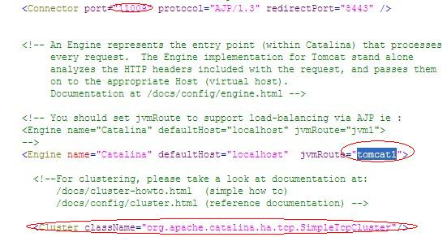
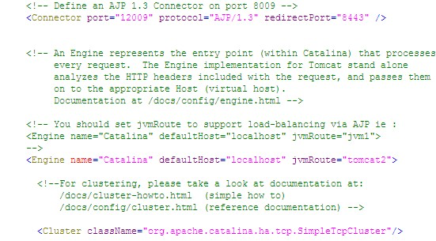
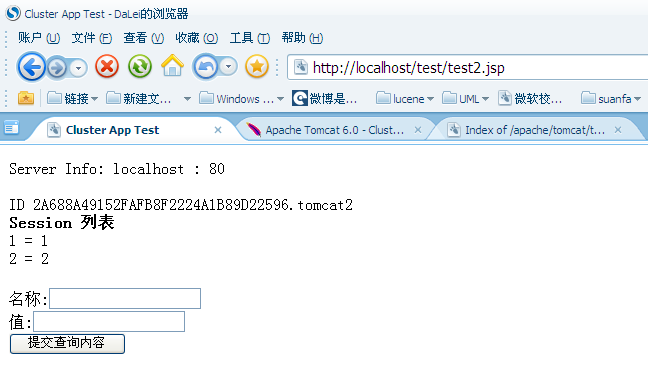

### apache + tomcat 负载均衡

本文Apache+Tomcat集群配置 基于最新的Apache和Tomcat，具体是2011年4月20日最新的Tomcat和Apache集群和负载均衡配置。

#### 准备环境

##### Apache

Apache是http服务器，我们利用其对Tomcat进行负载均衡。目前最新版本为2.2.17，下载地址
为```http://httpd.apache.org/download.cgi#apache22```。

如下图：


 

目前已经出现Apache2.3.11，但是为beta版本，所以没有使用。

下载后直接安装msi即可，如果没有其他的http服务器(如iis)则应该可以成功安装，端口即为80，能够访问```http://localhost/```说明安装成功。

##### Tomcat

Tocmat7目前已经出现稳定版本的7.0.12，Tomcat6则为6.0.32。经我测试，这2个版本的Apache负载均衡配置过程都是一样的，因此下面的配置在Tomcat6或7集群是通用的。但是按照下面的配置，集群中Tomcat不能既有Tomcat6又有Tomcat7，否则虽能够负载均衡，但不能进行session复制，不知其他方式配置的集群是否可以。

Tomcat就不用怎么介绍了。既然在本地需要多个节点，那么需要下载ZIP版本
的Tomcat。

##### JK

JK是Tomcat提供给http服务器的插件(个人理解的)，下载地址为```http://mirror.bjtu.edu.cn/apache/tomcat/tomcat-connectors/jk/binaries/win32/jk-1.2.31/```。如下图：
 

  

这里选择的是```mod_jk-1.2.31-httpd-2.2.3.so```，如果http服务器是Apache2.0.X版本，则必须选择```mod_jk-1.2.31-httpd-2.0.52.so```，页面下方有英文的说明，大家可以看下。

其实我也在网上看到Apache2.2已经集成Tomcat插件模块了，可以不用JK插件就可以实现Tomcat负载均衡，但也需要一些配置，而JK这个配置相比也不复杂，就先记录下来。

#### 配置过程

下面就直接写过程了，我也是网络上学习的，只是总结下过程并且利用最新的Apache和Tomcat测试了下，还是与网络上有些不同的。

##### 修改Apache配置

1、修改```httpd.conf```

我的Apache安装在```D:\Program Files\Apache Software Foundation\Apache2.2```，找到conf目录下的```httpd.conf```，在文件的最后一行添加

```
include "D:\Program Files\Apache Software Foundation\Apache2.2\conf\mod_jk.conf"
```

2、新建```mod_jk.conf```文件，内容如下：

```
LoadModule jk_module modules/mod_jk-1.2.31-httpd-2.2.3.so
JkWorkersFile conf/workers.properties
```

指定那些请求交给tomcat处理,"controller"为在```workers.propertise```里指定的负载分配控制器名

```
JkMount /*.jsp controller
```

3、将下载的JK插件```mod_jk-1.2.31-httpd-2.2.3.so```复制到Apache安装目录的modules目录下。

4、新建并编辑```workers.properties```文件，内容如下：

```
#server
worker.list = controller

#========tomcat1========
worker.tomcat1.port=11009
worker.tomcat1.host=localhost
worker.tomcat1.type=ajp13
worker.tomcat1.lbfactor = 1

#========tomcat2========
worker.tomcat2.port=12009
worker.tomcat2.host=localhost
worker.tomcat2.type=ajp13
worker.tomcat2.lbfactor = 1

#========tomcat3========
worker.tomcat3.port=13009
worker.tomcat3.host=192.168.0.80 //在我的虚拟机中的，可以算远程的吧
worker.tomcat3.type=ajp13
worker.tomcat3.lbfactor = 1
 
#========controller,负载均衡控制器========
worker.controller.type=lb
worker.controller.balanced_workers=tomcat1,tomcat2,tomcat3
worker.controller.sticky_session=false
worker.controller.sticky_session_force=1
#worker.controller.sticky_session=1
```

这里可以配置任意多个Tomcat，此处配置了3个Tomat服务器，2个本地，1个远程，所以为了它们都能够顺利启动起来，本地的服务器端口都是不同的，如果Tomcat不再同一机器上，没必要改端口的。

##### 配置Tomcat

配置3个Tomcat服务器，将Tomcat解压后复制3份，我将每个文件夹分别命名为Tomcat1，Tomcat2和Tomcat3，修改每一份的```server.xml```配置，将Tomcat1中修改部分如下图：



Tomcat2中以上部分的```server.xml```为：



Tomcat3中以上部分的```server.xml```为： 


因为Tomat3在远程服务器，所以没必要改端口的，而我先进行的本地集群测试后
将Tomcat3复制到远程服务器，所以这3个Tomcat端口都不同。

AJP13的connector的poat和jvmRoute名称和```workers.properties```中配置对应。

由于截图面积有限，还需要保证本地2个本地Tomcat配置server的port，connector为http1.1的port都不相同。

#### 测试

##### 建立测试项目

建立test项目，需要在项目的```web.xml```中添加```<distributable/>```

建立```test2.jsp```，内容如下(网上都用这个测试，我就省的麻烦了)：

```
<%@ page contentType="text/html; charset=GBK" %>
<%@ page import="java.util.*" %>
<html><head><title>Cluster App Test</title></head>
<body>

Server Info:

<%
out.println(request.getLocalAddr() + " : " + request.getLocalPort()+"<br>");%>
<%
  out.println("<br> ID " + session.getId()+"<br>");
  // 如果有新的 Session 属性设置
  String dataName = request.getParameter("dataName");
  if (dataName != null && dataName.length() > 0) {
     String dataValue = request.getParameter("dataValue");
     session.setAttribute(dataName, dataValue);
  }
  out.println("<b>Session 列表</b><br>");
  System.out.println("============================");
  Enumeration e = session.getAttributeNames();
  while (e.hasMoreElements()) {
     String name = (String)e.nextElement();
     String value = session.getAttribute(name).toString();
     out.println( name + " = " + value+"<br>");
         System.out.println( name + " = " + value);
   }
%>
  <form action="test2.jsp" method="POST">
    名称:<input type=text size=20 name="dataName">
     <br>
    值:<input type=text size=20 name="dataValue">
     <br>
    <input type=submit>
   </form>
</body>
</html>
```

上面的测试页面就不解释了，很好理解。

##### Session测试

将项目部署到3个服务器，然后分别启动Apache和3个Tocmat服务器，这些Tomcat启动顺序随意，然后打开```http://localhost/test/test2.jsp```，结果如下图：


F5刷新页面，分别出现：


 
多次刷新页面的sessionID看是同一个ID，说明session是复制成功了。那么session中的存储的东西呢，在输入框中分别输入1、1，2、2，3、3后，显示结果如下图： 

 

 

 
 
 
 
以上的测试说明，集群中的session已经共享，每个集群对于同一访问均有相同的session，而且session中存储的变量也复制了。
 
##### 节点插拔测试

插拔意思是应该保证当运行的集群中某节点中关闭或者启动时，集群正常工作并且节点能够正常工作。

下面描述测试过程了，贴图太占地方了。

关闭Tomcat2，刷新页面，则不断访问Tocmat1和Tomcat3，再关闭Tomcat1后，则只访问一个Tomcat3，说明节点关闭时运行正常。

如果重启Tomcat2，无论怎么刷新，始终访问Tomcat3，难道Apache不能将请求转发给中途启动的Tomcat2?。。。这时利用另外台机器访问页面，发现Tomcat2正常，然后在刷本地页面，又可以访问Tomcat2了。

从上面可以看出Apache的负载均衡时的算法了，对于每个新来的session，Apache按照节点配置中的lbfactor比重选择访问节点，如果某节点node1不能访问，则寻找下一可访问节点，并且将此node1就在该访问session的访问黑名单中，以后该session的访问直接不考虑node1，即使node1又可以访问了。而新来的session是无黑名单的，如果新的session能够访问到node1了，则会将node1在其他所有session访问的黑名单删除，这样其他session就又能访问node1节点
了。以上只是个人经过测试后的猜想。

经过以上测试，说明Tomcat集群和负载均衡已经实现了。
 
关于集群我还有些疑问，所以又测试了下，直接把结论写出来：

1. 集群下的相同的应用可以名称不同(好像没必要啊)，只要配置server.xml中host下的context具有相同的path即可。

2. 如果应用名称可以不同，那么应用下内容是否可以不同呢(这里考虑将不同应用通过集群看起来是一个应用，并且共享session)，然后集群下不同应用映射为相同的访问path，具有相同的路径则负载，如果某路径只某个应用具有，则一直访问该应用。可现实很骨干啊，答案是否定的，至少我以上的配置不能实现。如果访问只有某应用具有的特别路径，那么只有负载到该应用才可以访问，否则直接路径未找到的错误页面了。
 
 
 如果您看过网上其他Apache+Tomcat的集群配置，您可能有的疑问？

1.网上大部分的文章配置2个tocmat的集群，有的将workers.properties下的worker.controller.sticky_session=1，
然后tomcat1中的server.xml中的jvmRoute设置为tomcat2，将tomcat2中的jvmRoute设置为tocmat1，当然我这样设置
也成功了，但是如果3个或者更多tocmat呢,怎么设置每个tomcat的jvmRoute,我不会所以才考虑现在的配置

2.server.xml中的Cluster配置问题，网上大部分都是使用BackupManager方式，即Cluster下又粘贴了一堆配置。其实
只要将其中注释掉的<Cluster className="org.apache.catalina.ha.tcp.SimpleTcpCluster"/>去掉注释就完成session的集群
复制了。只是这俩种复制采用的方式不同而已。```http://tomcat.apache.org/tomcat-6.0-doc/cluster-howto.html```，
这页面已经说的挺清楚了，集群的session复制默认是DeltaManager，是all to all的复制，意思是将集群下1个tomcat应用下的session
对所有的集群中的节点进行复制，即使那个节点没有发布应用。显然是不好的方式，但这在小规模的集群下并没神马问题。

而采用BackupManager，就是众多网上配置那样，对于需要复制的节点设置BackupManager自然也没问题，
但是它的性能并没有DeltaManager 好使“ Downside of the BackupManager: not quite as battle tested as the delta manager”。

因此，具体怎么设置就看大家了，通常说如果不是大规模集群，就默认就好了。反正我自己翻译的就是这个意思了，希望没有误导大家。
