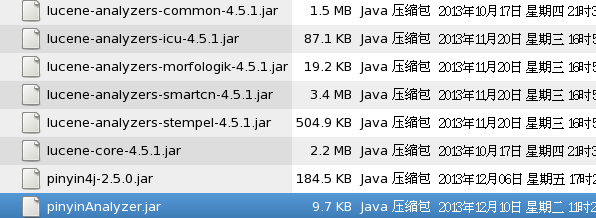
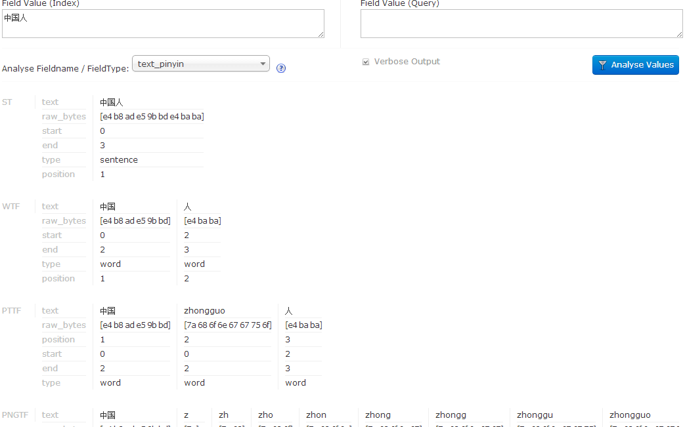

我使用的是solr4.5.1

第一步先把依赖的包导入

放到路径solr/contrib/analysis-extras/lucene-libs下，
所需要的包

其中：

lucene-analyzers-common-4.5.1.jar和
lucene-core-4.5.1.jar

在solr的默认包里没有，需要去下lucene框架，注意要和自己solr的版本一致才行，然后在里边找这两个包，在lucene下的文件结构是

```
lucene-4.5.1\analysis\common\lucene-analyzers-common-4.5.1.jar
lucene-4.5.1\core\lucene-core-4.5.1.jar
```

下边两个包也是里面没有的需要自己下载

```
pinyin4j-2.5.0.jar
pinyinAnalyzer.jar
```

第二步：配置solrconfig.xml文件，引入两个文件夹下的包，注意修改成符合自己项目的路径  

```
<lib dir="/home/luolong/soft/solrhome/solr/contrib/analysis-extras/lib" regex=".*\.jar"/>
<lib dir="/home/luolong/soft/solrhome/solr/contrib/analysis-extras/lucene-libs" regex=".*\.jar"/>
```

第三步：修改schema.xml文件

增加下边语句

```
<fieldType name="text_pinyin" class="solr.TextField" positionIncrementGap="0">
   <analyzer type="index">
      <tokenizer class="org.apache.lucene.analysis.cn.smart.SmartChineseSentenceTokenizerFactory"/>
      <filter class="org.apache.lucene.analysis.cn.smart.SmartChineseWordTokenFilterFactory"/>
      <filter class="com.shentong.search.analyzers.PinyinTransformTokenFilterFactory" minTermLenght="2" />
      <filter class="com.shentong.search.analyzers.PinyinNGramTokenFilterFactory" minGram="1" maxGram="20" />
   </analyzer>
   <analyzer type="query">
      <tokenizer class="org.apache.lucene.analysis.cn.smart.SmartChineseSentenceTokenizerFactory"/>
      <filter class="org.apache.lucene.analysis.cn.smart.SmartChineseWordTokenFilterFactory"/>
      <filter class="com.shentong.search.analyzers.PinyinTransformTokenFilterFactory" minTermLenght="2" />
      <filter class="com.shentong.search.analyzers.PinyinNGramTokenFilterFactory" minGram="1" maxGram="20" />
   </analyzer>
</fieldType>
```
和

```
<field name ="pinyin" type ="text_pinyin" indexed ="true" stored ="false" multiValued ="false"/>、
```

第四步：测试


