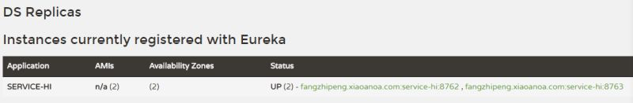

# 第二篇: 服务消费者（rest+ribbon）

在上一篇文章，讲了服务的注册和发现。在服务架构中，业务都会被拆分成一个独立的服务，服务与服务的通讯是基于http restful的。spring cloud有两种调用方式，一种是ribbon+restTemplate，另一种是feign。在这一篇文章首先讲解下基于ribbon+rest。

### ribbon简介

> Ribbon is a client side load balancer which gives you a lot of control over the behaviour of HTTP and TCP clients. Feign already uses Ribbon, so if you are using @FeignClient then this section also applies.

> —–摘自官网

ribbon是一个负载均衡客户端，可以很好的控制htt和tcp的一些行为。Feign也用到ribbon，当你使用@ FeignClient，ribbon自动被应用。

ribbon 已经默认实现了这些配置bean：

* IClientConfig ribbonClientConfig: DefaultClientConfigImpl
* IRule ribbonRule: ZoneAvoidanceRule
* IPing ribbonPing: NoOpPing
* ServerList ribbonServerList: ConfigurationBasedServerList
* ServerListFilter ribbonServerListFilter: ZonePreferenceServerListFilter
* ILoadBalancer ribbonLoadBalancer: ZoneAwareLoadBalancer

### 二、准备工作

基于上一节的工程，启动eureka-server 工程；启动service-hi工程，它的端口为8762；将service-hi的配置文件的端口改为8763,并启动它，这时你会发现：service-hi在eureka-server注册了2个，这就相当于一个小的集群。访问localhost:8761如图所示：



### 三、建一个服务消费者
重新新建一个spring-boot工程，取名为：service-ribbon;

它的pom.xml文件如下：

```
<?xml version="1.0" encoding="UTF-8"?>
<project xmlns="http://maven.apache.org/POM/4.0.0" xmlns:xsi="http://www.w3.org/2001/XMLSchema-instance"
    xsi:schemaLocation="http://maven.apache.org/POM/4.0.0 http://maven.apache.org/xsd/maven-4.0.0.xsd">
    <modelVersion>4.0.0</modelVersion>

    <groupId>com.forezp</groupId>
    <artifactId>service-ribbon</artifactId>
    <version>0.0.1-SNAPSHOT</version>
    <packaging>jar</packaging>

    <name>service-ribbon</name>
    <description>Demo project for Spring Boot</description>

    <parent>
        <groupId>org.springframework.boot</groupId>
        <artifactId>spring-boot-starter-parent</artifactId>
        <version>1.5.2.RELEASE</version>
        <relativePath/> <!-- lookup parent from repository -->
    </parent>

    <properties>
        <project.build.sourceEncoding>UTF-8</project.build.sourceEncoding>
        <project.reporting.outputEncoding>UTF-8</project.reporting.outputEncoding>
        <java.version>1.8</java.version>
    </properties>

    <dependencies>
        <dependency>
            <groupId>org.springframework.cloud</groupId>
            <artifactId>spring-cloud-starter-eureka</artifactId>
        </dependency>
        <dependency>
            <groupId>org.springframework.cloud</groupId>
            <artifactId>spring-cloud-starter-ribbon</artifactId>
        </dependency>
        <dependency>
            <groupId>org.springframework.boot</groupId>
            <artifactId>spring-boot-starter-web</artifactId>
        </dependency>

        <dependency>
            <groupId>org.springframework.boot</groupId>
            <artifactId>spring-boot-starter-test</artifactId>
            <scope>test</scope>
        </dependency>
    </dependencies>

    <dependencyManagement>
        <dependencies>
            <dependency>
                <groupId>org.springframework.cloud</groupId>
                <artifactId>spring-cloud-dependencies</artifactId>
                <version>Dalston.RC1</version>
                <type>pom</type>
                <scope>import</scope>
            </dependency>
        </dependencies>
    </dependencyManagement>

    <build>
        <plugins>
            <plugin>
                <groupId>org.springframework.boot</groupId>
                <artifactId>spring-boot-maven-plugin</artifactId>
            </plugin>
        </plugins>
    </build>

    <repositories>
        <repository>
            <id>spring-milestones</id>
            <name>Spring Milestones</name>
            <url>https://repo.spring.io/milestone</url>
            <snapshots>
                <enabled>false</enabled>
            </snapshots>
        </repository>
    </repositories>

</project>
```

向服务注册中心注册一个新的服务，这时service-ribbon既是服务提供者，也是服务消费者。配置文件application.yml如下：

```
eureka:
  client:
    serviceUrl:
      defaultZone: http://localhost:8761/eureka/
server:
  port: 8764
spring:
  application:
    name: service-ribbon
```

在工程的启动类中,通过@EnableDiscoveryClient向服务中心注册；并且注册了一个bean: restTemplate;通过@ LoadBalanced注册表明，这个restRemplate是负载均衡的。

```
@SpringBootApplication
@EnableDiscoveryClient
public class ServiceRibbonApplication {

    public static void main(String[] args) {
        SpringApplication.run(ServiceRibbonApplication.class, args);
    }

    @Bean
    @LoadBalanced
    RestTemplate restTemplate() {
        return new RestTemplate();
    }

}
```

这时我们需要测试下,建一个service类：

```
@Service
public class HelloService {

    @Autowired
    RestTemplate restTemplate;

    public String hiService(String name) {
        return restTemplate.getForObject("http://SERVICE-HI/hi?name="+name,String.class);
    }

}
```

通过restTemplate.getForObject方法，service-ribbon 就可以调用service-hi的方法了。并且在调用的工程中并之需要写服务的名，而不是具体的ip.

写一个controller:

```
/**
 * Created by fangzhipeng on 2017/4/6.
 */
@RestController
public class HelloControler {

    @Autowired
    HelloService helloService;
    @RequestMapping(value = "/hi")
    public String hi(@RequestParam String name){
        return helloService.hiService(name);
    }


}
```

访问 [http://localhost:8764/hi?name=forezp](http://localhost:8764/hi?name=forezp) ,浏览器交替显示：

>hi forezp,i am from port:8762
>
>hi forezp,i am from port:8763

这说明当我们通过调用restTemplate.getForObject(“http://SERVICE-HI/hi?name=“+name,String.class)，获取service-hi的方法时，已经做了负载均衡，访问了不同的端口的服务。

### 四、此时的架构


* 一个服务注册中心，eureka server,端口为8761
* service-hi工程跑了两个副本，端口分别为8762,8763，分别向服务注册中心注册
* sercvice-ribbon端口为8764,向服务注册中心注册
* 当sercvice-ribbon通过restTemplate调用service-hi的hi接口时，因为用ribbon进行了负载均衡，会轮流的调用service-hi：8762和8763 两个端口的hi接口；

源码下载：[https://github.com/forezp/SpringCloudLearning/tree/master/chapter2](https://github.com/forezp/SpringCloudLearning/tree/master/chapter2)
