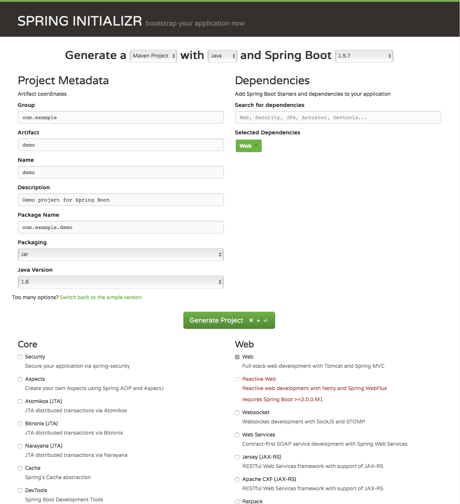
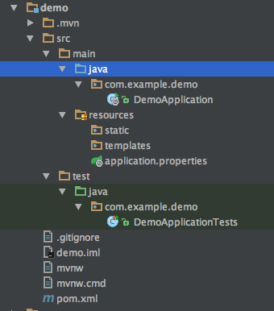

# SpringBoot

* 如何构建SpringBoot项目
* 如何实现RESTful API接口
* 如何实现多环境的SpringBoot应用配置
* 深入理解SpringBoot配置的启动机制
* SPringBoot应用的监控与管理

SpringBoot是构建微服务的基础，通常咱们构建一个web应用的话，大概方法是，创建Web工程，让后吧web工程放在tomcat服务器里面运行，但是SpringBoot就贼简单，启动一下main方法就可以了，因为springboot中已经集成了tomcat中间件，废话少说咱们现在开始
。

## 如何构建SpringBoot项目

**系统及工具版本要求**

* JAVA7及以上版本
* Spring Framework 4.2.7及以上版本
* Maven 3.2 及以上版本

**构建Maven项目**

1.通过官方的 Spring Initializr工具来产生基础项目。

2.访问 http://start.spring.io/ ,入下图所示，该页面提供了以Maven或Gradle构建Spring Boot 项目功能

3.选择构建工具Maven Project 、 Spring Boot 版本默认就行，填写Group 和 Artifact 信息，在Search for dependencies中可搜索需要的其他依赖包，这里我们要实现RESTful API，所以可以添加web依赖。

4.点击Generate Project 按钮下载项目压缩包。

5.解压项目包，并用IDE以 Maven项目导入，以IntelliJ IDEA 14为例。

6.从菜单中选择File-->New-->Project from Existing Sources...。

7.选择解压后的项目文件夹，点击OK按钮。

8.点击Import project from external model 并选择Maven，
一直点击Next按钮。

9.若你的环境有多个版本的JDK，选择JAVA SDK 的时候请选择JAVA7以上的版本。

**工程结构解析**

咱们现在来看一下构建完成的工程吧。

* src/main/java: 主程序入口 HelloApplication ，可以通过直接运行该类来启动Spring Boot 应用。

* src/main/resources : 配置目录，改目录用来存放应用的一些配置信息，比如应用名
