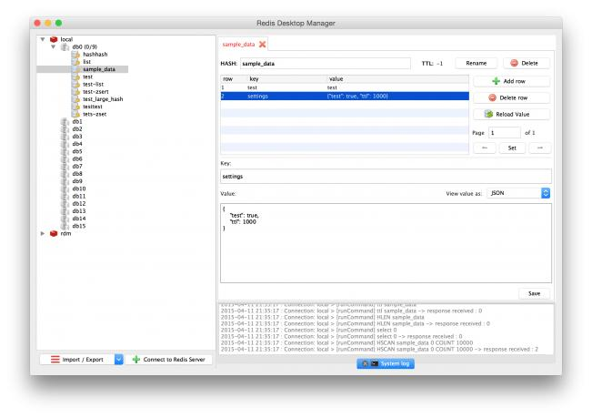
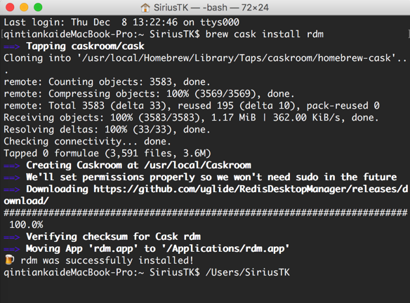
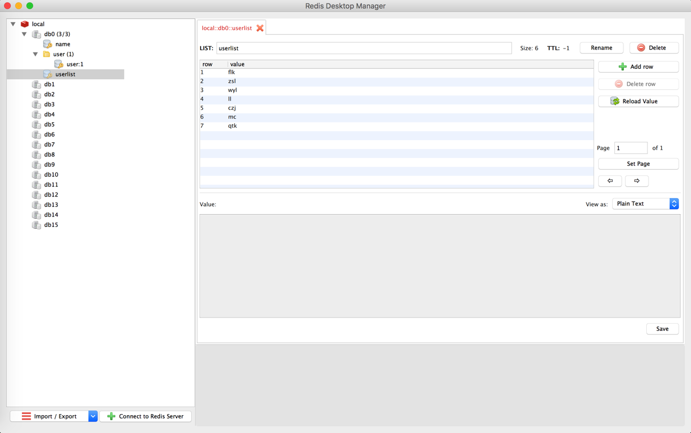

Redis是一个超精简的基于内存的键值对数据库(key-value)，一般对并发有一定要求的应用都用其储存session，乃至整个数据库。不过它公自带一个最小化的命令行式的数据库管理工具，有时侯使用起来并不方便。不过Github上面已经有了很多图形化的管理工具，而且都针对REDIS做了一些优化，如自动折叠带schema的key等。

Redis Desktop Manager

一款基于Qt5的跨平台Redis桌面管理软件

支持: Windows 7+, Mac OS X 10.10+, Ubuntu 14+

特点： C++ 编写，响应迅速，性能好。但不支持数据库备份与恢复。

项目地址： https://github.com/uglide/RedisDesktopManager



#### 安装方法

* 安装brew cask : 在终端中输入下面语句 回车

```
ruby -e "$(curl -fsSL https://raw.githubusercontent.com/Homebrew/install/master/install)" < /dev/null 2> /dev/null ; brew install caskroom/cask/brew-cask 2> /dev/null

作者：SiriusTK
链接：http://www.jianshu.com/p/214baa511f2e
來源：简书
著作权归作者所有。商业转载请联系作者获得授权，非商业转载请注明出处。
```

可能会需要你的mac密码，输入即可

* 安装Redis Desktop Manager

安装完cask之后，在终端中输入 回车

```
brew cask install rdm
```

安装完成后



打开rdm.app 连接redis数据库



也可以去项目的github找最新的版本

```
https://github.com/uglide/RedisDesktopManager/releases/
```
